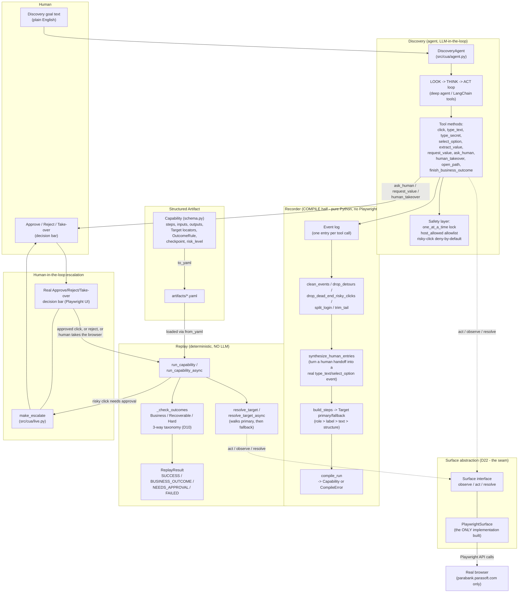
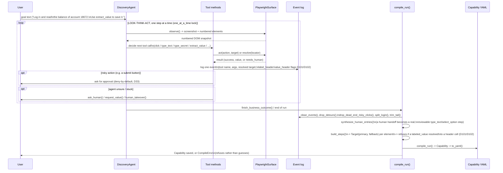

# Architecture: Agent + Discovery Pipeline

This doc diagrams how the system is actually built (`src/cua/` + the phase notebooks it was ported
from), and flags one honest gap between the assignment brief and this implementation: **the brief
assumes a heterogeneous, often-legacy, not-necessarily-clean DOM (Section 3.7 / glossary
"Heterogeneous, Often Legacy Surfaces" / "The Real Environment"); this implementation is built and
tested against ParaBank, a real but structurally clean, modern Bootstrap DOM.** That gap is
already logged in `DECISIONS.md` (D22's own "Known cost" note, quoted at the bottom of this doc) —
it was not missed, it was accepted and the mitigation is the `Surface` seam, not a claim that the
seam was ever exercised against a dirty DOM.

## 1. High-level component architecture

Key point for the clean-DOM question: **every arrow that touches the real page** — `TOOLS` acting,
`RESOLVE` resolving a locator, the decision bar rendering — goes through the `Surface`
interface's single implementation, `PlaywrightSurface`. That interface is the intended point where
a legacy/non-clean surface (desktop accessibility API, a vision-only surface, a dirtier DOM with no
stable `id`s or `role`s) would plug in without touching `DiscoveryAgent`, the recorder, or the
replay engine. **It was designed for that, but never tested against anything other than ParaBank's
own clean DOM** — see the callout at the bottom.

## 2. How discovery actually happens (sequence)

## 3. The clean-DOM gap, explicitly

The brief's glossary and Section 3.7 assume "Heterogeneous, Often Legacy Surfaces" and describe
"The Real Environment" as one where DOMs are not guaranteed clean or stable. This project's real
target — ParaBank — is a real, live, third-party site, but its DOM is a modern, well-structured
Bootstrap table/form layout: stable `id`s, real `<label for>` associations, real `role`s. The
locator strategy (`role > label > text > structure`, D8) and the whole `Target(primary, fallback)`
model (D63) were built and tested against exactly that kind of DOM.

`DECISIONS.md` says this plainly, and this diagram is the place to repeat it rather than let it stay
buried:

> **Known cost:** the DOM is clean, so the legacy/no-clean-DOM story cannot be *shown* in code; it
> is argued in the report through the `Surface` seam (D22) and the ranked locators (D8). Also,
> being a third-party server, we cannot force failures on demand; we inject faults browser-side
> instead (D30).
> — `DECISIONS.md`, line 74

So the architecture's answer to "what if the DOM isn't clean" is a **design argument**, not a
**demonstrated** one:
- `Surface` (D22) is a real interface with one real implementation (`PlaywrightSurface`); a second
  implementation (desktop accessibility API, or a vision-based fallback) was never written, so the
  interface's shape is inferred from the one clean-DOM case it was actually built against.
- The ranked locator strategy (`role > label > text > structure`, falling back through weaker
  signals) is the mechanism meant to survive a messier page, but it has only ever been exercised on
  pages where `role`/`label` were already reliable — a dirtier page (no `role`s, duplicate/absent
  labels, D68's own stated gap) would fall to `structure`/`text` far more often, and that path is
  far less tested.
- Section 7 explicitly does not reward building tenant/legacy plumbing, and D64 went further and
  removed even the placeholder schema fields (`app.id`/`app.vendor`/`base`/`overrides`) that once
  gestured at it — so heterogeneity is now a pure prose argument in `REPORT.md`, with literally no
  schema surface backing it.

**Bottom line:** the architecture is *designed* to generalize past a clean DOM (that's what the
`Surface` seam and ranked locators are for), but everything actually built, tested, and evidenced in
this repo only proves it against ParaBank's clean one. That's a real, disclosed limitation, not a
silent one — but it is a limitation.
