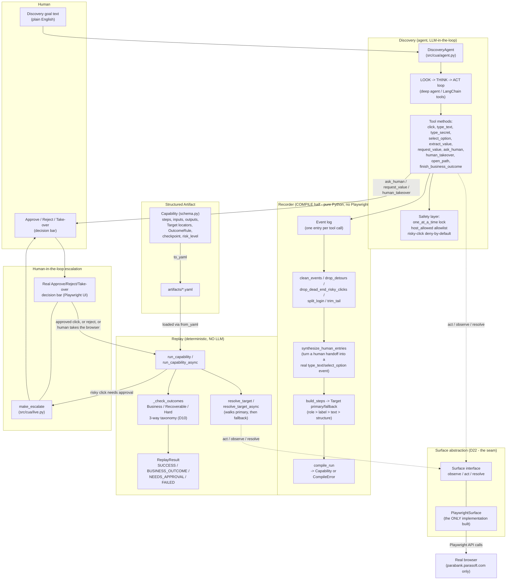
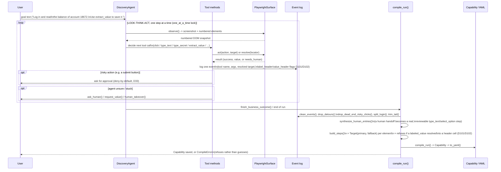

# Architecture: Agent + Discovery Pipeline

This doc diagrams how the system is actually built (`src/cua/` + the phase notebooks it was ported
from), and flags one honest gap between the assignment brief and this implementation: **the brief
assumes a heterogeneous, often-legacy, not-necessarily-clean DOM (Section 3.7 / glossary
"Heterogeneous, Often Legacy Surfaces" / "The Real Environment"); this implementation is built and
tested against ParaBank, a real but structurally clean, modern Bootstrap DOM.** That gap is
already logged in `DECISIONS.md` (D22's own "Known cost" note, quoted at the bottom of this doc) —
it was not missed, it was accepted and the mitigation is the `Surface` seam, not a claim that the
seam was ever exercised against a dirty DOM.

## 1. High-level component architecture



Key point for the clean-DOM question: **every arrow that touches the real page** — `TOOLS` acting,
`RESOLVE` resolving a locator, the decision bar rendering — goes through the `Surface`
interface's single implementation, `PlaywrightSurface`. That interface is the intended point where
a legacy/non-clean surface (desktop accessibility API, a vision-only surface, a dirtier DOM with no
stable `id`s or `role`s) would plug in without touching `DiscoveryAgent`, the recorder, or the
replay engine. **It was designed for that, but never tested against anything other than ParaBank's
own clean DOM** — see the callout at the bottom.

## 2. How discovery actually happens (sequence)



## 3. The clean-DOM gap, explicitly

The brief's glossary and Section 3.7 assume "Heterogeneous, Often Legacy Surfaces" and describe
"The Real Environment" as one where DOMs are not guaranteed clean or stable. This project's real
target — ParaBank — is a real, live, third-party site, but its DOM is a modern, well-structured
Bootstrap table/form layout: stable `id`s, real `<label for>` associations, real `role`s. The
locator strategy (`role > label > text > structure`, D8) and the whole `Target(primary, fallback)`
model (D63) were built and tested against exactly that kind of DOM.

`DECISIONS.md` says this plainly, and this diagram is the place to repeat it rather than let it stay
buried:

> **Known cost:** the DOM is clean, so the legacy/no-clean-DOM story cannot be *shown* in code; it
> is argued in the report through the `Surface` seam (D22) and the ranked locators (D8). Also,
> being a third-party server, we cannot force failures on demand; we inject faults browser-side
> instead (D30).
> — `DECISIONS.md`, line 74

So the architecture's answer to "what if the DOM isn't clean" is a **design argument**, not a
**demonstrated** one:
- `Surface` (D22) is a real interface with one real implementation (`PlaywrightSurface`); a second
  implementation (desktop accessibility API, or a vision-based fallback) was never written, so the
  interface's shape is inferred from the one clean-DOM case it was actually built against.
- The ranked locator strategy (`role > label > text > structure`, falling back through weaker
  signals) is the mechanism meant to survive a messier page, but it has only ever been exercised on
  pages where `role`/`label` were already reliable — a dirtier page (no `role`s, duplicate/absent
  labels, D68's own stated gap) would fall to `structure`/`text` far more often, and that path is
  far less tested.
- Section 7 explicitly does not reward building tenant/legacy plumbing, and D64 went further and
  removed even the placeholder schema fields (`app.id`/`app.vendor`/`base`/`overrides`) that once
  gestured at it — so heterogeneity is now a pure prose argument in `REPORT.md`, with literally no
  schema surface backing it.

**Bottom line:** the architecture is *designed* to generalize past a clean DOM (that's what the
`Surface` seam and ranked locators are for), but everything actually built, tested, and evidenced in
this repo only proves it against ParaBank's clean one. That's a real, disclosed limitation, not a
silent one — but it is a limitation.

**Next:** this gap is being addressed by §4, the pure-visual discovery engine (in design).

## 4. Pure-visual discovery engine (redesign, in design)

Status: **in design.** Nothing below is built yet. Decided items are user-confirmed; open
questions are not.

Discovery-only docs live in `notebooks/discovery/`: `discovery_architecture.md` (simple
diagram, each box, all tools, a step-by-step run) and `decisions.md` (every discovery question,
its options, and the decision).

### Why

- The spec, p.2 "The real environment": *"You cannot assume a clean DOM, stable selectors, or an
  API. In many cases the only reliable surface is what a human operator sees and does."*
- The spec, §3.1: *"Bias toward an approach that would still work when the surface has no clean
  DOM."*
- §3 above shows the current engine only proves itself on ParaBank's clean DOM. This redesign
  removes the DOM from the loop entirely, so the claim can be *shown*, not just argued.

### Decided (user-confirmed)

- **Pure visual everywhere, including ParaBank.** Screenshot, then OCR, then mouse/keyboard at
  coordinates. No DOM reads, no `page.evaluate`, no accessibility tree.
- **OCR engine:** RapidOCR only.
- **Proof:** two runs, both pure visual.
  - A hostile local page: framesets, nested tables, no `id`s, no `<label>`s.
  - A ParaBank re-run.
- **Locators: 3 fixed rungs, always.** Replay tries them in order:
  1. `primary`: `OcrTextLocator` (fuzzy text + search region).
  2. `fallback`: `AnchorLocator` (landmark text + `dx`/`dy` offset + size).
  3. `visual_fallback`: `VisualTemplateLocator` (image-crop match).
  - Optional `ordinal` ("nth match") on the text and anchor locators, for repeated labels.
    Example: the 2nd "Amount" on the page.
  - This **supersedes D63's 2-rung `Target`**. The DOM locator types are retired in the new engine.
- **Drift log.** Records which rung matched on each step. Flags a capability for review when it
  keeps falling to rung 2 or 3.
- **Step verification: OCR-diff on a bounded poll.** Re-check about every 200ms until the expected
  text appears or a time budget runs out. Same shape as the existing D88 poll.
- **Playwright's role shrinks** to navigation, screenshot, and mouse/keyboard only.
- **Hard rules kept:**
  - `type_secret`: the model never sees the value; keys are sent via the keyboard.
  - `host_allowed`: gates URLs. That is not a DOM read, so it stays.
  - Risky-click gate (Approve / Reject / Take-over): now triggered by the element's OCR text
    matched against a risky-word list. The list lives in **config**, never in agent code.
- **Notebook-first.** Built in a new `notebooks/discovery/discovery` notebook first. `src/cua/` is untouched until a
  later port.
- **Q7 (decided): no shape detector.** Things with no text (empty inputs, icon-only buttons)
  get no number. The agent points at them itself with a new `click_at(x, y)` tool, using the
  screenshot it already sees (no extra LLM call).
  - After every `click_at`, a new screenshot checks that something changed; if not, the agent
    retries.
  - The recorder saves the click relative to the nearest OCR label (rung 2, `AnchorLocator`),
    never as a raw x,y.
  - **Rungs are used only in replay.** Discovery (the LLM, looking) just records them; replay
    (plain code, no LLM) tries them in order on a live screenshot.
  - **A thing with no text has no rung 1.** It gets rung 2 (label + offset, e.g. "Username,
    150px right") and rung 3 (a small picture). Replay never clicks raw screen coordinates.
  - **Rung 3's picture is cut at discovery, before the action**, so it shows the empty field
    and never a typed value or password dots. Replay only searches live screenshots for it.
  - **Replay checks every step** by OCR-ing the spot again (the typed value, or dots for a
    secret). If all rungs fail, replay stops and asks a human.
  - Depends on Q10: positions only hold if window size and zoom are fixed.
  - Fallback, only if the hostile page shows repeated misses: add OpenCV edge detection.
- **Q8 (decided): no region detector. Tables use a row + column rule (`TableCellLocator`).**
  - Replay (plain code) OCRs the screen, finds the row whose text is the row key (e.g.
    `13455`), finds the column whose header is the column name (e.g. `Balance`), and reads the
    text where they cross (e.g. `$100.00`). The value is then type-checked; on failure replay
    stops and asks a human.
  - The code is generic. Only the values are site-specific, and discovery fills them into the
    capability: `row_key` (usually an input, e.g. `{{account_id}}`) and `column`.
  - Survives moved columns and added rows, unlike a fixed offset (rung 2).
  - Only for row/column layouts; a single labelled value uses the normal rungs.
  - Fallback, only if the hostile page shows this is not enough: an OpenCV grid-line detector.
- **Q9 (decided): OpenCV, for pixel jobs only.** It never finds elements in discovery.
  - Discovery: draws the numbered red boxes and cuts the rung 3 picture (before the action).
  - Replay: rung 3, finding the saved picture in a live screenshot (`matchTemplate`); match
    threshold lives in **config**. Two near-equal best matches = not found, ask a human.
  - Already installed as a RapidOCR dependency, so nothing new is added.
- **Q10 (decided): lock the viewport and save it.** Discovery runs at a fixed window size and
  zoom (e.g. 1280×800 at 100%; the values live in **config**). Both are saved in the
  capability. Replay sets the same values via Playwright before step 1, and refuses to run
  if it cannot. No scaling of coordinates or pictures.
- **Q11 (decided): `notebooks/discovery/discovery.py` + paired `discovery.ipynb` (jupytext).** The user runs
  the `.ipynb`; the `.py` gives readable git diffs. `notebooks/agent_2_legacy_surface.py` is
  deleted once its ideas (e.g. `VisualTemplateLocator`) are folded into `discovery`, and only
  with the user's go-ahead at that time.
- **Q12 (decided): dropdowns by keyboard.** Native `<select>` popups may not appear in page
  screenshots, so the agent never needs to see the list.
  - First: click the dropdown, type the option text, press Enter.
  - Fallback: if OCR of the closed box shows the wrong option, press ↓ one at a time,
    re-reading the box after each press, until it shows the right one (bounded; then ask a
    human).
  - Replay step: find the dropdown by its rungs, type `{{input}}`, Enter, check the box shows
    it. Mouse and keyboard only; no DOM reads.
- **Tool shapes (decided): no new typing tools, no custom input code.**
  - `type_text` and `type_secret` take either a number (`type_text(7, "john")`) or a point
    (`type_text(at=(420, 210), "john")`), so empty input boxes (Q7) can be typed into in one
    step. `click_at(x, y)` stays for clicking text-less things.
  - Every tool is a thin wrapper over Playwright's mouse/keyboard only: `mouse.click`,
    `keyboard.type`, `keyboard.press`, `mouse.wheel`. Playwright's DOM-based commands
    (`page.fill`, `select_option`, `get_by_label`) are not used.
  - The wrapper adds only our rules: number → screen point, secret hidden from the model,
    risky-click gate, host check. After typing, the box is re-read (text, or dots for a
    secret); a failed `type_secret` check stops and asks a human, never retries blindly.
- **Q13 (decided): a `scroll` tool, then a fresh look.**
  - Discovery: `scroll("down" | "up")` runs Playwright `mouse.wheel` (distance in
    **config**, about ¾ of the screen so some overlap stays), then takes a new screenshot and
    renumbers. Numbers from before the scroll are refused ("look again").
  - Same screenshot before and after = "bottom of page reached", so the agent can't scroll
    forever. Optional `at=(x, y)` scrolls inside a small scrolling panel.
  - Replay: each scroll is saved as its own step. If rungs 1-3 all miss a target, replay
    scrolls down and retries, up to a limit in **config** (e.g. 5), then asks a human.
  - Rejected: auto-scroll inside `click` (can't help discovery), tall window / full-page
    screenshot (clashes with Q10). Page Down / End keys can be added later if needed.
- **Q14 (decided): no customer data in saved pictures.** The rung-3 crop is cut tight to the
  element's own box, and any OCR text inside it that isn't the element's own label is blanked
  out before saving. Customer data never goes into saved files, the same rule as secrets.

### Discovery engine — block diagram

Discovery only. Recorder and replay are drawn separately later.

```
┌──────────────────────────────────────────────────────────────────────────┐
│                         DISCOVERY  (LLM loop, D2)                         │
│                                                                           │
│  goal text  ("log in and read the savings balance")                       │
│        │                                                                  │
│        ▼                                                                  │
│  ┌────────────────────────┐                                               │
│  │     DiscoveryAgent      │   LOOK → THINK → ACT, one tool call per step │
│  │   (deep agents, LLM)    │                                              │
│  └───────────┬─────────────┘                                              │
│              │ calls one tool per step                                    │
│   ┌──────────┼───────────────────┬──────────────────────┐                 │
│   ▼          ▼                   ▼                      ▼                 │
│ observe()  click(ref)          type_secret(ref,name)  open_path(path)     │
│ "look"     type_text(ref,val)  model sees the NAME,   finish(...)         │
│            select_option(...)  never the value                            │
│            scroll(dir)      click_at(x,y): no number, agent points at it  │
└────┬─────────┬──────────────────────┬──────────────────────┬──────────────┘
     │         │                      │                      │
     ▼         ▼                      ▼                      ▼
┌──────────────────────────────────────────────────────────────────────────┐
│                    ScreenSurface   (Surface seam, D22)                    │
│              the ONLY code that talks to Playwright                       │
│                                                                           │
│  observe():                          act(ref, action):                    │
│   1. page.screenshot()                1. ref → box from last observe()    │
│   2. → Perception                     2. box centre, adjusted for         │
│   3. → Element model                     scroll offset + pixel ratio      │
│   4. numbered overlay → agent         3. page.mouse.click(x, y)  or       │
│                                          page.keyboard.type(...)          │
│  open_path(): host_allowed(url) → page.goto()                             │
│  scroll():    page.mouse.wheel() → coordinates recomputed next observe()  │
└───────────┬──────────────────────────────────────────┬────────────────────┘
            │ screenshot (PNG)                         │ mouse / keyboard only
            ▼                                          ▼
┌───────────────────────────────────────┐     ┌──────────────────────────┐
│             Perception                 │     │        Playwright         │
│                                        │     │  navigate · screenshot    │
│  RapidOCR ─▶ (text, box, confidence)   │     │  mouse · keyboard         │
│                                        │     │  NO DOM reads, ever       │
│  No shape detector (Q7, decided):      │     └──────────────────────────┘
│    agent points at unlabelled things   │
│                                        │
│  No region detector (Q8, decided):     │
│    tables read by row + column rule    │
└───────────────────┬────────────────────┘
                    │ text boxes
                    ▼
┌───────────────────────────────────────┐
│             Element model              │
│  ScreenElement {ref, text, box,        │
│                 confidence, kind}      │
│  kind = text (OCR only, Q7)            │
│                                        │
│  numbered overlay: red box + number    │
│  drawn on the screenshot               │
└───────────────────┬────────────────────┘
                    │ screenshot with boxes
                    │ + list "[7] 'Transfer' at (412,88)"
                    ▼
            back up to DiscoveryAgent

┌──────────────────────────────────────────────────────────────────────────┐
│                  SAFETY GATE  (runs before every act())                   │
│  needs_human(ref): element's OCR text vs risky-word list (from CONFIG)    │
│    risky + over auto-approve limit ─▶ BLOCK ─▶ Approve / Reject /         │
│                                                Take over   (D14, D28)     │
│  host_allowed(url): gates every navigation                                │
└──────────────────────────────────────────────────────────────────────────┘
                    │ every tool call + result + screenshot
                    ▼
        Event log (jsonl) ─▶ recorder   (out of scope for this diagram)
```

**How to read it**

- The model never touches OCR or Playwright. It only sees the numbered screenshot and the text list, and it only calls named tools.
- `ScreenSurface` is the single choke point. Way in: screenshot → OCR → numbered elements. Way out: ref → box centre (or a `click_at` point) → mouse/keyboard.
- No DOM read anywhere. Playwright is used for navigation, screenshots, mouse and keyboard only.
- Nothing in the diagram is open any more: Q7-Q14 are all decided.

### Open questions (NOT decided)

None. Q7-Q14 are all decided above.
