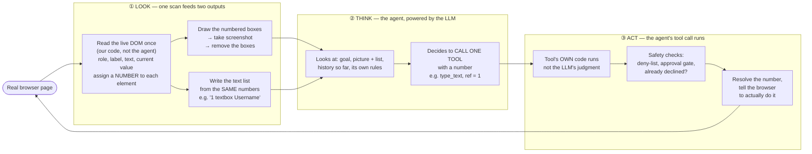

# Phase 1 — The Agent

**What this phase is, in one line:** an AI that looks at a real browser page, decides one thing to do, and does it — over and over — until a goal is reached, a human is needed, or it gives up cleanly.

**Built in:** `notebooks/agent.ipynb`
**Decisions:** `DECISIONS.md` — D1–D6 (setup), D2 (this section), D14, D19–D20, D32–D34, D50–D62 (safety and handoff, built through live testing)

---

## D2 — How the agent perceives and acts on the UI

**The question:** during discovery, how does the AI see the page and choose what to do?

**The choice:** a hybrid. The AI gets a screenshot **and** a numbered text list of everything on the page. It picks a number. Our code resolves that number to the real element. Pixels and numbers are never saved — only a description of the element is, for replay later.

### The loop, as a diagram

LOOK is one scan feeding two outputs (the picture and the list), not two separate perception channels.

### What "scan the page once" actually does

It is not reading the raw HTML source as text, and it is not the screenshot either — those are two different things people sometimes assume it is. It reads the browser's live **DOM** (the rendered structure the browser holds in memory, not the static HTML file): a small script run *inside* the already-loaded page, asking the browser directly for its live, rendered elements — every link, button, non-hidden input, dropdown, textarea, and anything explicitly marked as a button/link role. For each one it works out:

- Its **role** (an `<input type="submit">` and a `<button>` both resolve to `"button"`).
- Its **name** (tried in order: an `aria-label`, then a real `<label>` pointing at it, then its own text/value, then a placeholder/title/alt/name attribute — first one found wins).
- Its **current value** (skipped for passwords and buttons).
- Its **on-screen position and visibility** (anything with zero size or `display: none` is skipped entirely).

Only after all of that is numbered does drawing and the screenshot happen.

**This whole scan is our own fixed code (`OBSERVE_JS`), not the agent.** The LLM is not invoked for this step at all, has no say in how a role or a name gets computed, and only ever sees the finished result — the numbered picture and the text list — once this has already run.

The number is thrown away after every step; nothing about "box [1]" or its pixel position is ever saved. Only a *description* of the element gets saved, for replay later.

### What "reasoning" actually means here

"Reasoning" is not multi-step planning done once — at every single moment the agent looks fresh at the same four things (goal, current picture+list, history so far, its own rules) and decides to call one tool. That step repeats for the whole run.

A distinction worth keeping explicit: **the agent decides *which* tool to call; the tool's own code decides *whether it is allowed to happen*.** The LLM can ask for anything — the deny-list, the approval gate, and the locator resolution all run inside the tool's own code, unconditionally, whatever the LLM intended. This is why the system's safety does not depend on the model's judgment.

### Worked example

Goal: *"Log in and read the balance of account 14232."*

| # | What the agent SEES | What the agent THINKS | Tool the agent calls (then the tool's own code executes it) |
|---|---|---|---|
| 1 | Login page. List: `[1] textbox "Username"`, `[2] textbox "Password"`, `[3] button "Log In"` | "This is a login form. My rule says: log in first, using the stored secret, never type a real password myself." | `type_secret(ref=1, name="username")` |
| 2 | Same page, box [1] now shows filled dots | "Username's in. Password box is still empty." | `type_secret(ref=2, name="password")` |
| 3 | Both boxes filled | "Both fields are filled. Time to submit." | `click(ref=3)` |
| 4 | New page: Accounts Overview. List: `[1] link "13899"`, `[2] link "14232"`, `[3] link "Transfer Funds"` | "The page changed, so I'm logged in. My goal needs account 14232, and I see it right there as [2]." | `click(ref=2)` |
| 5 | New page shows "Balance: $1,200.00" in the text | "The value I need is right here on the page. Nothing left to click." | `page_text()` |
| 6 | Text back: "...Balance: $1,200.00..." | "Found what I needed. Goal's done." | `finish(values={"balance": "$1,200.00"})` |

Every row is one full look→think→act moment.

### Two known, honestly-stated edge cases

- **An element with no name at all** (no label, no aria-label, no visible text) still gets found, numbered, and shown on screen — only its *name* comes back empty. A human-facing message falls back to a generic `"field N"` unless the model supplies its own visual reading.
- **Two elements with the identical name** (e.g. two "Edit" links) are told apart fine during discovery — different numbers, different positions, visible in the picture. At replay time, only some locator strategies can be scoped to a specific container to disambiguate; others cannot yet. Flagged as a required test case for the Phase 3 recorder rebuild.

---

*More sections to follow: the tools (click/type/select/extract/etc.), the safety gate, the human handoff and page lock, and the stuck-goal guards.*
