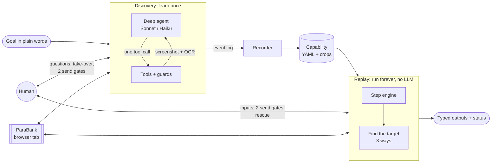
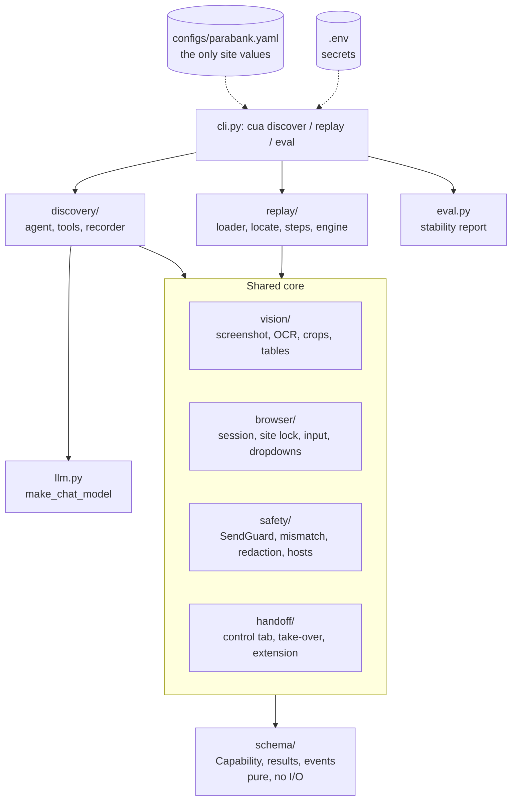
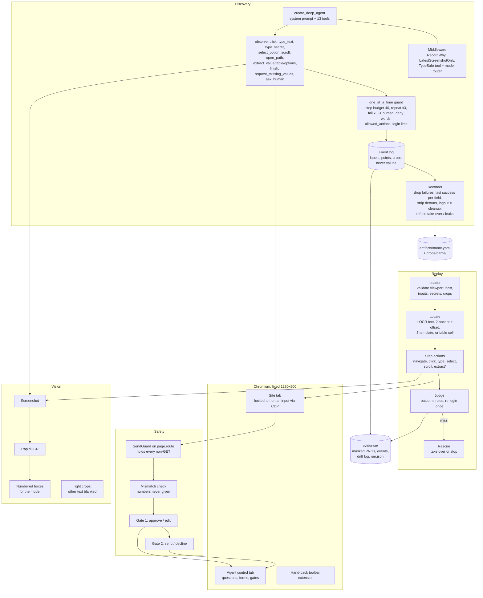
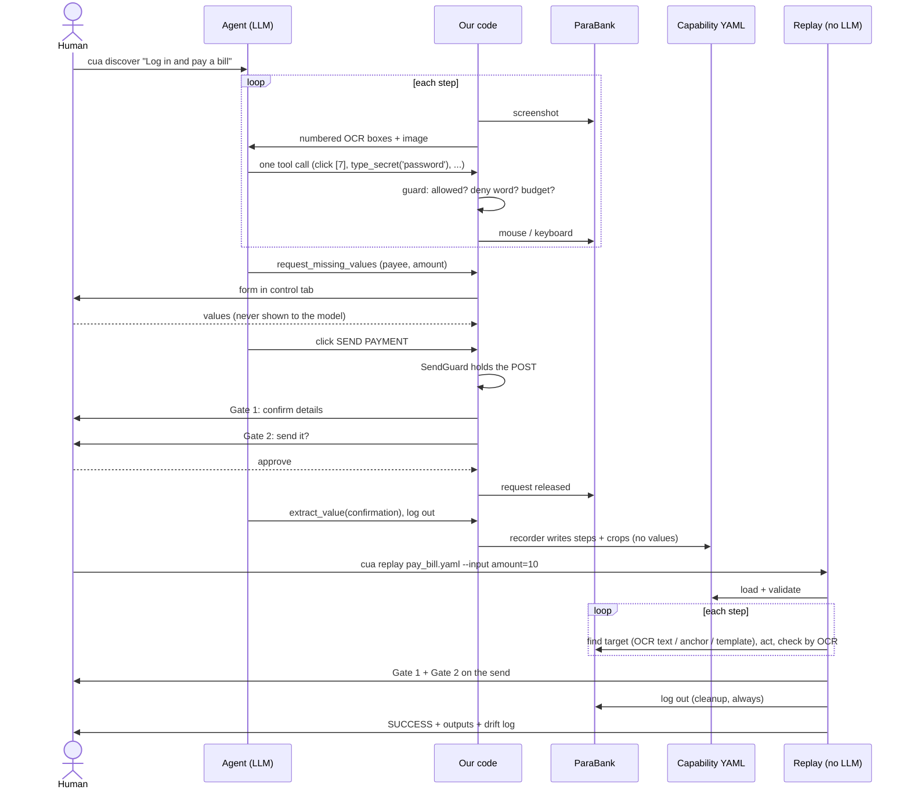

# Teller: learn a banking task once, replay it forever

https://github.com/user-attachments/assets/5ef8c957-d093-440a-b31c-b6f06ea4ec09

*The 46-second intro, with sound. The file is also at [`brag-output/brag.mp4`](brag-output/brag.mp4).*

## The problem

Banks and credit unions still run their daily work on **legacy web portals**: bill pay, transfers,
loan requests, balance lookups. Many were built a decade or more ago and are rarely rewritten.

- **Old code, old DOM.** Layout tables, nested frames, server-rendered pages, no stable `id`s, no
  `<label>`s, no accessibility tree worth reading. Element structure changes with every vendor patch.
- **No API.** The portal *is* the integration. There is often nothing to call but the screen.
- **Every tenant is different.** The same vendor product looks a little different at each bank, so
  one script per bank becomes hundreds of scripts.
- **Today's options don't hold up.**
  - Scripted RPA and DOM selectors break as soon as the markup moves.
  - A pure LLM agent re-reasons through every run: slow, paid per step, and not repeatable, which
    is risky when money moves.
- **The stakes are high.** Payments can't be guessed, credentials can't leak into a model, and
  customer data can't sit in logs.

## The solution

**Teller** treats the portal the way a person does: it looks at the screen and uses the mouse and
keyboard. It never depends on the DOM, so old markup doesn't matter.

1. **Learn once.** An AI agent learns a task on a real banking web app (ParaBank) **from
   screenshots alone**. A human answers its questions and approves every send at two gates.
2. **Write it down.** It saves what it learned as a **capability**: a YAML recipe plus a few tiny
   image crops. No customer values, no credentials.
3. **Replay forever.** A separate **replay** engine runs that recipe with plain code and **no LLM**.
   It finds each target by its text, a nearby label, or its look, never by DOM path or fixed x,y.

```
discover (agent + browser)  ->  artifacts/<name>.yaml + crops/  ->  replay (no LLM, browser)
```

> **Demo bank: ParaBank.** Everything here runs live on
> [ParaBank](https://parabank.parasoft.com/parabank/), Parasoft's open-source demo bank
> ([source](https://github.com/parasoft/parabank)). It is a good stand-in for the real thing: a
> classic server-rendered banking portal with real flows (login, accounts overview, transfers,
> bill pay, loans) and an old-school DOM. It holds only fake data, so the agent can log in, move
> "money" and hit the send gates with no real customer at risk. Nothing in the code is
> ParaBank-specific: its URL, words and login names live in one file, `configs/parabank.yaml`
> (see [Configure the bank](#configure-the-bank-or-swap-in-another-one)).

**Business impact**

- **Pay for the thinking once.** Learning bill pay took **16-21 model turns** (see the
  `evidence/discovery/*pay_bill*` transcripts). Every replay after that takes **0**.
- **Legacy portals, as they are.** No API, no vendor integration, no DOM selectors to maintain.
- **Same steps every time.** Replay is a fixed recipe in plain code: auditable and repeatable, with
  no model guessing.
- **A human signs off on every money movement.** Each payment or transfer stops at **two approval
  gates**, and replay never auto-approves.
- **Lower compliance risk.** Credentials never reach the model, no customer value is stored, and
  evidence is masked.
- **New tenant = one config file.** Another bank on the same product needs a YAML profile, not a
  code change.

## The agent

Discovery is one **deep agent** built with LangChain's [`deepagents`](https://github.com/langchain-ai/deepagents)
(`create_deep_agent`, on LangGraph), in `src/cua/discovery/agent/build.py`. It gets the visual
system prompt, 13 tools (`observe`, `click`, `type_text`, `type_secret`, `select_option`, `scroll`,
`open_path`, `extract_value`, `extract_table`, `extract_options`, `request_missing_values`,
`ask_human`, `finish_business_outcome`) and a checkpointer, so a run paused for a human resumes
where it stopped. Middleware wraps every model call:

- `OnlyOurTools`: deepagents always adds its own file tools and `task` sub-agent tool. This
  middleware drops them from every model call, so the model is offered only our 13 tools, and
  refuses (`REFUSED`) any call to them.
- `RecordWhy`: logs the model's one-line reason for each tool call (masked) into the evidence.
- `LatestScreenshotOnly`: only the newest screenshot stays in context, which keeps every turn small.
- The TypeSafe tool router and model router below, when switched on.

**Models.** Claude only, called directly through Anthropic (`cua.llm.make_chat_model`):

| Role | Model | When |
|---|---|---|
| Powerful (default) | Claude Sonnet (`claude-sonnet-5`) | every step when routing is off; any step the router isn't sure about |
| Fast | Claude Haiku 4.5 (`claude-haiku-4-5-20251001`) | a simple, unambiguous step, and only when the router is confident |

Replay uses no model at all.

### Observability (LangSmith)

Discovery is traced in [LangSmith](https://smith.langchain.com). It's switched on by environment
variables only (`LANGSMITH_TRACING`, `LANGSMITH_ENDPOINT`, `LANGSMITH_API_KEY`, see Setup); LangChain
sends the traces, no extra code.

- **Agent trace:** every run is one trace: each model call, each tool call with its arguments and
  result, the middleware (TypeSafe routing, `OnlyOurTools`), and the agent's reasoning per step.
- **Latency:** per model call, per tool call and per run, so slow steps (OCR, page loads, the
  human gates) show up directly.
- **Cost:** token usage per call and the cost per run, split by model, so Haiku vs Sonnet routing
  can be compared run to run.
- **Replay** makes no model calls, so a replay costs nothing and has no trace.
- **What leaves the machine:** what the model sees (screenshots, the goal, its own messages).
  Secrets never do: the model only ever sees their names. Fake data only.

### Guardrails (NeMo)

Discovery checks the goal with [NeMo Guardrails](https://github.com/NVIDIA/NeMo-Guardrails)
before the browser opens. Rails are written in Colang in `configs/rails/`.

- **Input rails:** off-topic, jailbreak, steering ("give me control", "skip the gates") and
  sensitive/emotional goals are refused. The goal is checked sentence by sentence and whole.
- **How it decides:** local embeddings first (no API call); only an unclear goal goes to Haiku.
- **Refused goal:** prints why, writes a `REFUSED` evidence folder (rail and score only), exits 1.
  The browser never opens and the agent spends nothing.
- **Output rail:** the final answer is masked (card numbers, SSNs, account ids); a credential or a
  secret value withholds it.
- **Fails closed:** if the rails error or time out, the goal is refused.
- **Setup:** `uv sync --extra rails`. The first run downloads the embedding model (~90 MB).
  `rails: off | on | required` in the site config; `on` runs without the extra (prints
  "guardrails OFF"), `required` refuses every goal until it's installed.

### Confidence-driven tool selection and model routing (TypeSafe)

Optional: on when `TYPESAFE_API_KEY` is set (`uv sync --extra typesafe`), else the agent runs Sonnet
with every tool. Code: `src/cua/discovery/agent/routing.py`.

Before **each** model call, a [TypeSafe](https://typesafe.ai) classifier answers two multiple-choice
questions about the current step. Each answer comes back with a **confidence** score, and the
confidence decides whether we act on it.

Why trust that score: TypeSafe's models are trained with **RLCD** (Reinforcement Learning for
Calibrated Decisions), which rewards confidence that matches real accuracy rather than answers people
prefer. A calibrated "0.9" is right about 90% of the time, so a fixed threshold is a meaningful
cut-off, not a guess:

1. **Which job is this step?** One of `login`, `fill_form`, `read_value`, `navigate`, `need_human`,
   `finish`. At confidence **≥ 0.8**, the tool list is narrowed to that job's tools plus four that
   are always kept (`observe`, `click`, `type_secret`, `ask_human`). For example, a `fill_form` step
   sees `type_text`, `select_option` and `scroll`, not the extract or finish tools. Below 0.8, all
   13 tools stay.
2. **Fast or powerful model?** Haiku is used only when the answer is `fast` **and** confidence is
   ≥ 0.8. Otherwise the step goes to Sonnet.

Design rules:

- **Fails open.** A low-confidence answer, a timeout or any classifier error changes nothing: all
  tools, Sonnet. Routing can only save cost; it can never block a step.
- **Per step, not per run.** TypeSafe's stock model router decides once per run from the goal, so a
  multi-step goal never reached Haiku. Ours asks again at every step.
- **Minimal data out.** The classifier sees only the page name, the last tool's name and its status
  word (`OK`, `REFUSED`, `Saved`). Never screen text, URL tokens or values.

## Business use case

**What Teller does.**

| | Old way | Teller |
|---|---|---|
| Old, messy DOM | Selectors break on every patch | Not used: reads the screen |
| Learning a task | An engineer writes selectors | The agent learns it once from screenshots |
| Running it | LLM every time, or brittle selectors | Plain code, no LLM, no API key |
| Cost per run | Tokens per step | ~0 |
| Same input, same steps? | Not guaranteed | Yes: a fixed recipe |
| Money leaves the account | Agent may decide | Always two human approval gates |
| Customer data at rest | Often logged | Never stored; evidence is masked |
| Page drifts a little | Breaks | Falls back to other ways of finding the target, and logs which one it used |

**Who uses it.**

- **Banking ops teams:** turn a repetitive portal task (pay a bill, read every account balance,
  list the accounts you can pay from) into a one-line command.
- **Conversational banking assistants:** call a capability as a tool. The caller gets typed
  outputs; a human approves every send.
- **Multi-tenant vendors:** one base capability per vendor product. A tenant is one config file,
  not a code change.

Saved examples: `artifacts/` (`pay_bill`, `pay_bill_to_payee`, `transfer_funds_between_accounts`,
`request_loan`, `get_all_account_balances`, `get_account_balance`, `get_transfer_account_options`).
`takeover_demo` is a fault-injection demo (a broken target that forces a human take-over), not a
discovered task.

## Architecture

### 1. The big picture



### 2. Low-level architecture (abstract)

The package is `src/cua/`, layered so the two sides never import each other.



Import rules (tested in `tests/unit/test_import_rules.py`): `schema` imports nothing else from
`cua`; `discovery` and `replay` never import each other; `replay` has no model import.

### 3. Extended architecture



### 4. Flow: one capability, end to end



## How it works

**Pure visual.** Each step: screenshot a fixed 1280x800 page, OCR it, draw a red number on every
text box, and show the model the image plus `[7] 'Transfer'`. The model picks one tool; our code
acts with `page.mouse` / `page.keyboard` and checks the result with a second screenshot. No DOM
reads, no accessibility tree. One exception: native `<select>` dropdowns (macOS draws their list
outside the page), which are set and read through a small script and confirmed by OCR.

**The model picks; our code decides.** Every tool call passes guards: one call at a time, a step
budget, repeat and failure limits, deny words, the site's `allowed_actions`, and login limits. When
unsure, the agent (or the guard) calls a human, who can answer, take over, or stop.

**The recorder, not the model, writes the steps.** Steps come from the event log, the ground
truth. Failed calls are dropped, the last success per field is kept, detours are cut, and the final
logout becomes a cleanup step. The model writes only the name, descriptions and success text.

**Replay is deterministic.** It loads and checks the YAML, asks every missing input in one form,
then walks the steps: find the target (OCR text, then anchor + offset, then template), act, check by
OCR. A send or a secret is never retried. Known page messages map to a status; a session expiry
re-logs in once. Cleanup (logout) always runs.

| Status | When |
|---|---|
| `SUCCESS` | all steps done, checkpoint seen, outputs read |
| `DECLINED` | a human said no at Gate 2; nothing sent |
| `STUCK` | a human stopped it, rejected Gate 1, or an input was blank or wrong |
| `FAILED` | bad YAML, wrong screen size, host blocked, action not allowed, checkpoint or output missing |
| `BUSINESS_OUTCOME` | a known answer, e.g. "not found", "insufficient funds" |

A person's help is shown on the status and listed, value-free, in `human[]`:

- `SUCCESS (human input at step N)`: replay asked for a value (e.g. picked an account from the
  options) and a person chose it.
- `SUCCESS (human intervened at step N)`: replay could not go on, a person took over, then handed back.

Design and trade-offs: `REPORT.md`. Every decision: `notebooks/discovery/decisions.md` (Q*, routing
is Q22) and `notebooks/replay/DECISIONS.md` (R*).

## Setup

Needs Python 3.12+, [`uv`](https://docs.astral.sh/uv/), and a desktop with a display (the browser
runs visibly). Built and tested on macOS.

```bash
uv sync                                  # add --extra typesafe for the optional tool/model router
uv run playwright install chromium
uv run python -m ipykernel install --user --name banker-agent --display-name "BankerAgent (.venv)"
cp .env.example .env                     # then fill in the keys below
```

`.env` (git-ignored):

| Key | Needed for | Notes |
|---|---|---|
| `PARABANK_USERNAME` / `PARABANK_PASSWORD` | discovery and replay | a ParaBank demo user (fake data only). Typed by `type_secret`; the model sees the name, never the value |
| `ANTHROPIC_API_KEY` | discovery only | every LLM call goes direct to Anthropic (`src/cua/llm.py`) |
| `SSL_CERT_FILE` | optional | a corporate CA bundle, if your network needs one |
| `TYPESAFE_API_KEY` | optional | turns on TypeSafe tool selection + per-step Haiku/Sonnet routing for discovery. Needs `uv sync --extra typesafe` |
| `LANGSMITH_TRACING` / `LANGSMITH_ENDPOINT` / `LANGSMITH_API_KEY` | optional | LangSmith traces for discovery: agent trace, latency, token usage and cost per run (see "Observability") |
| (extra) `rails` | optional | NeMo input rails on the discovery goal; `uv sync --extra rails` |

Replay needs no LLM key at all.

> ParaBank's demo database resets now and then, which deletes registered users. If login fails
> with "could not be verified", re-register the same user in a normal browser before running
> discovery. Fixing it through a take-over makes the run unsavable.

## Configure the bank, or swap in another one

Everything bank-specific lives in **one YAML file**: `configs/<site>.yaml`. The code in `src/` has no
site values in it, and a test enforces that (`tests/unit/test_no_site_values.py`). It is loaded
into a frozen `SiteProfile` by `cua.config.load_site("<site>")`.

### What the file holds (`configs/parabank.yaml`, shortened)

```yaml
name: parabank
start_url: "https://parabank.parasoft.com/parabank/"   # where every run starts; base_url for artifacts
allowed_hosts: [parabank.parasoft.com]                  # the host lock: anything else is refused / sent back
secret_env:                                             # secret NAME -> env var NAME (never the value)
  username: PARABANK_USERNAME
  password: PARABANK_PASSWORD
deny_words: [register, lookup, admin]                   # clicks / paths with these words are refused
login_words: ["log in"]                                 # the login button's text: its POST skips the gates
allowed_actions: [navigate, click, type, select, scroll, extract, extract_table]  # omit = all allowed
login_failure_texts: [could not be verified, user does not exist, invalid username or password]
login_empty_texts: [please enter a username and password]   # boxes were empty: retry once
outcomes:                                               # text seen after a step -> replay status
  - {text: insufficient funds, status: BUSINESS_OUTCOME, meaning: not enough funds}
  - {text: session expired,    status: RECOVER,          meaning: the session expired}
  - {text: error,              status: FAILED,           meaning: the site showed an error page}
```

| Key | Used by | What it does |
|---|---|---|
| `start_url` | both | First page opened; becomes the capability's `base_url` |
| `allowed_hosts` | both | Host lock for clicks, `open_path`, `navigate` and a capability's `base_url` |
| `secret_env` | both | Which `.env` variables hold the login. `type_secret('password')` looks it up by name |
| `deny_words` | discovery | Hard refusals (e.g. never open "admin" or "register") |
| `login_words` | both | The login click is the only send that skips the two gates |
| `allowed_actions` | both | Step types the site permits. Unknown names fail at load |
| `login_failure_texts` / `login_empty_texts` | discovery | Stop on a failed login; retry once on empty boxes |
| `outcomes` | replay | `BUSINESS_OUTCOME`, `RECOVER` (re-login once) or `FAILED`. First match wins; a capability's own `outcomes:` replaces them |

### Swap in another bank

1. **Copy the profile.**
   ```bash
   cp configs/parabank.yaml configs/mybank.yaml
   ```
   Then edit `name`, `start_url`, `allowed_hosts`, and the words your site actually shows: login
   button text, login-failure messages, business messages like "insufficient funds".
2. **Name its secrets.** Point `secret_env` at new variables and add them to `.env`:
   ```yaml
   secret_env: {username: MYBANK_USERNAME, password: MYBANK_PASSWORD}
   ```
   ```bash
   MYBANK_USERNAME=...
   MYBANK_PASSWORD=...
   ```
3. **Pick it with `--site`.** With one file in `configs/`, it's the default. With two or more,
   `--site` is required:
   ```bash
   .venv/bin/cua discover "Log in and read the first account's balance" --site mybank --out artifacts/mybank
   .venv/bin/cua replay artifacts/mybank/get_account_balance.yaml --site mybank
   ```
4. **Re-discover the tasks.** Capabilities are per site. Each one stores its `base_url` and crops,
   and replay refuses one whose host isn't in the chosen profile's `allowed_hosts`. Keep each bank's
   artifacts in their own folder (`--out artifacts/<site>`).

Nothing in `src/` changes. A second tenant on the same vendor product is one more YAML file.

**Limits to know:** the page must render at 1280x800 at scale 1 (replay refuses any other size).
Login is assumed to be a username + password form. Native `<select>` dropdowns are the only place
the code touches the page's script; everything else is screenshots, mouse and keyboard.

## Run it

### CLI

```bash
.venv/bin/cua discover "Log in and get the balance of every account" --out artifacts
.venv/bin/cua replay artifacts/get_all_account_balances.yaml --evidence
.venv/bin/cua replay artifacts/transfer_funds_between_accounts.yaml \
  --input amount=5 --input from_account=<id> --input to_account=<id>
.venv/bin/cua eval artifacts/get_all_account_balances.yaml --runs 3
```

- `--site` picks a profile from `configs/` (defaults to the only one there: `parabank`).
- `cua replay` exits 1 unless the result is `SUCCESS`.
- `cua eval` replays one capability N times in one session and prints a stability table: status
  counts, success rate, human-assisted runs, a rung histogram per step, steps that fell back from
  their first-choice rung, and whether outputs matched across runs (yes/no, never the values). It
  writes `evidence/eval/<UTC>-<name>/report.json`. Every input must be given with `--input`, and it
  exits 1 unless every run is `SUCCESS`.
- For each unstable output, eval prints one value-free line saying what differs: rows per run, the
  differing column, or the cell shape. A step whose target has no OCR text (anchor only) is not
  flagged as a fallback when the anchor finds it.

**What you'll see.** Chromium opens with the bank tab and an "Agent control" tab. When the agent
(or replay) needs you, the control tab comes to the front: answer a question, fill a form, or
approve/edit a send at the two gates. If you take over, the site unlocks; click **Done** (or the
toolbar hand-back icon) to hand back. Discovery saves the YAML + crops (refused after a take-over)
and a masked `evidence/discovery/<UTC>-<goal>/` folder. Replay asks every input in one form, stops
any send at Gate 1 and Gate 2, and prints the status, outputs and drift log (which rung found each
step).

## Evidence

Masked run folders live in `evidence/` (layout: `evidence/README.md`).

| Capability | Discovery run (saved it) | Replay / eval runs |
|---|---|---|
| `get_all_account_balances` | `discovery/20261003T004411Z-log_in_and_get_the_balance_of_every_acco` | `replay/20261003T005702Z` SUCCESS; `replay/20261003T011355Z` SUCCESS; `eval/20261003T013804Z` 3/3 SUCCESS, outputs stable; `eval/20261003T010917Z` 3/3 SUCCESS, outputs differed (one-off) |
| `get_account_balance` | `discovery/20261003T004013Z-log_in_get_balance_for_my_account` | none yet (checkpoint fixed after discovery) |
| `pay_bill_to_payee` | `discovery/20261002T050328Z-log_in_pay_bill_to_with_account_from_my_` | `replay/20261003T010220Z` SUCCESS (confirmation read) |
| `get_transfer_account_options` | `discovery/20261002T045655Z-log_in_pay_bill_give_me_options_from_and` | `replay/20261003T010531Z` SUCCESS |
| `request_loan` | `discovery/20261002T073727Z-log_in_request_for_a_loan` | `replay/20261003T010624Z` BUSINESS_OUTCOME (loan denied: not enough funds for the down payment) |
| `transfer_funds_between_accounts` | `discovery/20261003T015535Z-log_in_and_transfer_from_account_344_to_` | `replay/20261003T015748Z` SUCCESS, confirmation read; a person picked the account (the demo DB had reset). This run predates `human[]` recording, so its `human[]` is empty |
| `takeover_demo` (fault-injection demo, not discovered) | - | `replay/20261003T015212Z` SUCCESS (human intervened at step 4); `replay/20261003T012310Z` SUCCESS on the old checkpoint; `replay/20261003T011842Z` FAILED pre-fix (below) |
| `pay_bill` | `discovery/20261002T075648Z-log_in_pay_bill` | - |

Pre-fix runs (kept as evidence of bugs the live runs found):

- `replay/20261003T004519Z`, `004612Z` (balances): STUCK at step 6 (table read). Menu text was
  taken as the table header. Fixed in `85595bf`, `27ef5ef`.
- `replay/20261003T004836Z` (balances): SUCCESS but an empty table. Same bug; fixed in `27ef5ef`.
- `replay/20261003T005631Z`, `010142Z` (`pay_bill_to_payee`): STUCK at step 10 (Address). OCR read
  `1Main`. Fixed in `07664f2`.
- `replay/20261003T011842Z` (`takeover_demo`): FAILED. The read step was skipped after the take-over.
  Fixed in `0c4c75a`.

Live check of `OnlyOurTools`: `discovery/20261003T023017Z-log_in_and_get_the_balance_of_every_acco`,
run after `f2feffe`. The agent called only our tools, and `extract_table` read the table in one call.
Its artifact went to `/tmp` and is not committed.

Older runs (before the `cua` package, no `run.json`): `replay/20260930T091210Z-get_all_account_balances`
(SUCCESS), `replay/20260930T223218Z-transfer_money` (SUCCESS; `transfer_money` is retired, replaced by
`transfer_funds_between_accounts`), `replay/20260930T033412Z-pay_bill` (STUCK at step 6 after a
take-over), `replay/20260930T041553Z-transfer_funds` (FAILED: site error page; retired). Their
discovery runs: `discovery/20260930T055623Z-log_in_get_account_balance_for_all_accou`,
`discovery/20260930T035011Z-log_in_transfer_funds`.

Take-overs during discovery (failed login, re-register, hand back) are recorded in
`summary.json`, e.g. `discovery/20261002T074508Z-log_in_pay_bill`.

## Guard rails

- **Every send is held.** `SendGuard` holds every non-GET request at the network layer, however it
  was triggered (login is exempt). A mismatch check flags any number the human never gave, then
  Gate 1 (approve / edit) and Gate 2 (send / decline). The agent never approves; replay never
  auto-approves.
- **Allowed actions.** `allowed_actions` in `configs/<site>.yaml` (ParaBank: `navigate, click,
  type, select, scroll, extract, extract_table`). Discovery refuses any other (`REFUSED`, logged);
  replay fails that step before acting.
- **Run timeout.** `DiscoveryConfig.run_timeout_s` (default 900). Past it the run ends `STUCK`;
  cleanup and evidence still run.
- **Typed inputs.** The recorder types each input from the *shape* of what was typed (`email`,
  `phone`, `date`, `currency`, `number`, `integer`, `id`, else `string`), never the value. Replay
  checks each given input and stops (`STUCK`, name and type only) on a mismatch.
- **`why` on events.** Each discovery event carries the model's masked reason, max 200 chars.
- **Confirmation saved.** After an approved send, the agent saves the confirmation number (or
  message) before finishing.
- **Secrets.** `type_secret(name)`: the model sees only the name. Values live in `.env` only.
- **Host lock and deny words.** Only `parabank.parasoft.com`; clicks on `register`, `lookup`,
  `admin` are refused.
- **Nothing stored.** No value a human typed or gave is kept. Evidence is masked (`***` in text,
  black boxes in PNGs).

## Tests

No key, no browser, no network:

```bash
.venv/bin/python -m pytest -q tests     # 1731 passed (2026-10-02)
.venv/bin/mypy --strict src             # no issues (71 files)
uvx ruff check src tests                # lint
```

The suite covers the send gates and mismatch check, the "nothing stored" rule, evidence masking,
artifact save/load, the targeting rungs, replay's step engine, take-over evidence, the import rules,
the `cua` CLI (monkeypatched), the model factory, and a round trip (`build_capability` ->
`save_artifact` -> replay's `load_capability`, unchanged).

## Repo layout

```
src/cua/               the package (src/cua/README.md: read order and import rules)
  config.py            SiteProfile (from configs/<site>.yaml), Browser/Discovery/ReplayConfig, secrets
  llm.py               make_chat_model
  schema/              the contract: Capability, value types, results, events
  vision/              pixels -> text: screenshots, OCR, canvas math, crops, table reader
  browser/             Playwright session, site lock, input, native dropdowns
  safety/              SendGuard (Gate 1/2), mismatch check, redaction, host allow-list
  handoff/             the "Agent control" tab, hand-back extension, take-over loop
  discovery/           the agent: tools, prompt/middleware/router, recorder, evidence
  replay/              the engine: loader, locate (rungs), steps, rescue, evidence
  eval.py              cua eval's report (pure)
  cli.py               cua discover / replay / eval
configs/parabank.yaml  the ONLY place ParaBank values live
artifacts/             saved capabilities (<name>.yaml) and their crops (crops/<name>/)
notebooks/             discovery/ and replay/ demos, decisions, architecture notes
extensions/handback/   Chrome toolbar extension for handing control back
tests/                 unit/ mirrors src/cua/; integration/ round trip + notebook parity
evidence/              masked discovery/ and replay/ run folders; cua eval writes eval/ (evidence/README.md)
brag-output/           the intro video (brag.mp4), its looping preview (brag-preview.gif) and poster (brag.jpg)
```

## Rules this code keeps

- Only host allowed: `parabank.parasoft.com`. Fake data only.
- Secrets live in `.env` only: never in the YAML (names only), the logs, or the model's context.
- No value a human typed or gave is stored. Evidence is masked.
