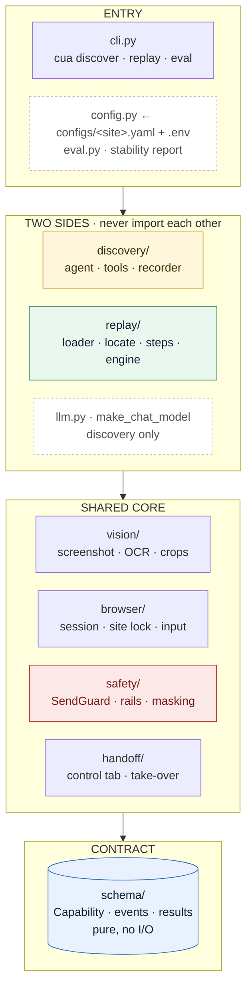
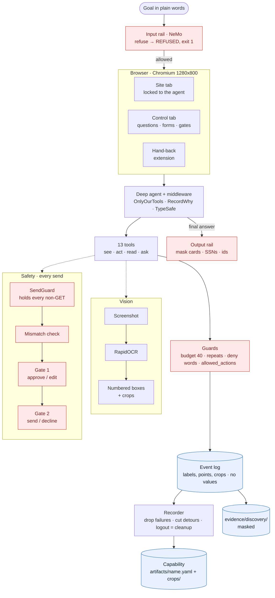
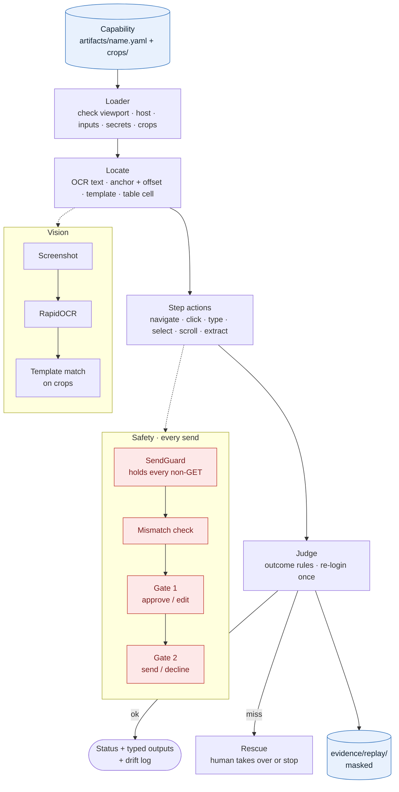
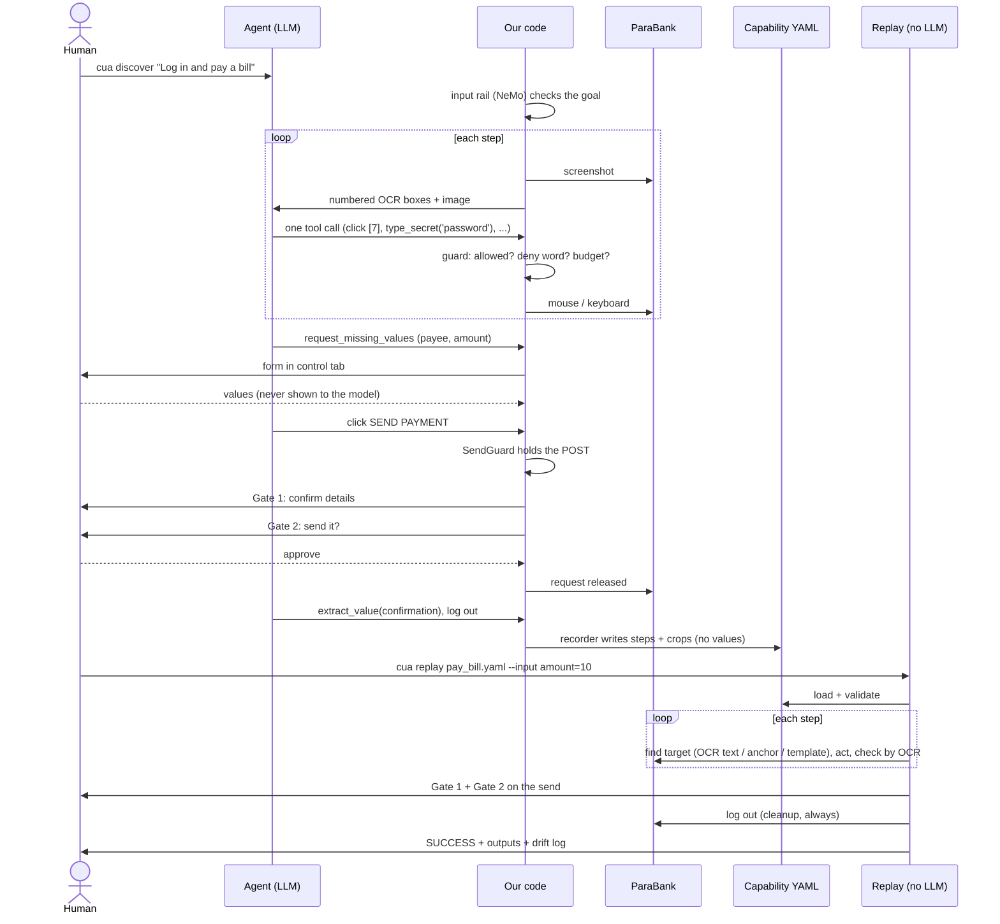
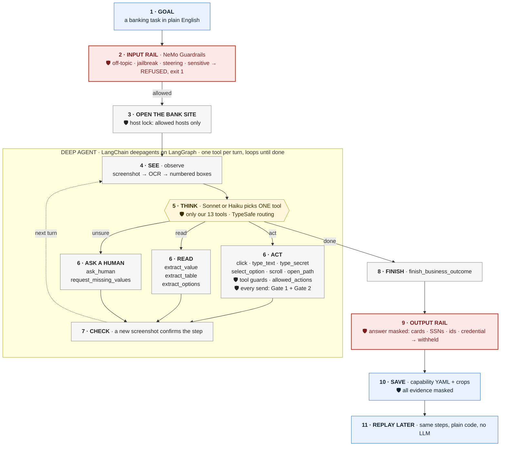

# Teller: learn a banking task once, replay it forever

https://github.com/user-attachments/assets/5ef8c957-d093-440a-b31c-b6f06ea4ec09

*The 46-second intro, with sound. The file is also at [`brag-output/brag.mp4`](brag-output/brag.mp4).*

## The problem

- **Banks run on legacy web portals.** Bill pay, transfers, loans, balances. Built a decade ago, rarely rewritten.
- **No API, no clean DOM.** The screen is the only integration. Layout tables, frames, no stable `id`s or `<label>`s.
- **Every tenant differs.** The same vendor product looks a little different at each bank. One script per bank means hundreds of scripts.
- **Today's tools break or burn tokens.** Selectors and RPA break when markup moves. An LLM agent re-reasons every run: slow, paid per step, not repeatable.
- **Money can't be guessed.** Payments need a human sign-off. Credentials and customer data must never reach a model or a log.
- **The business case:** teach a repetitive task once, then run it many times for free, on the portal as it is.

## The solution

- **Learn once.** An AI agent (discovery) learns a task **from screenshots alone**, like a person: look, click, type. No DOM.
- **Save a capability.** A YAML recipe plus a few tiny image crops. No customer values, no credentials.
- **Replay many times.** Plain code, **no LLM, zero tokens**. Finds each target by its text, a nearby label or its look.
- **Humans approve every send.** Two gates on every payment or transfer. Replay never auto-approves.
- **Guardrails.** NeMo input rail on the goal, masked output, host lock, typed inputs, masked evidence.

```
discover (agent + browser)  ->  artifacts/<name>.yaml + crops/  ->  replay (no LLM, browser)
```

Learning bill pay took **16-21 model turns** (`evidence/discovery/*pay_bill*`). Every replay after that takes **0**.

> **Demo bank: [ParaBank](https://parabank.parasoft.com/parabank/)**, Parasoft's open-source demo bank
> ([source](https://github.com/parasoft/parabank)): a classic server-rendered portal with real flows and
> fake data only. Nothing in `src/` is ParaBank-specific; its values live in `configs/parabank.yaml`
> (see [Configure the bank](#configure-the-bank-or-swap-in-another-one)).

## Architecture

### 1. Main architecture


- Discovery uses a model; replay never does. The capability file is the only thing between them.
- A human is in the loop on both sides: questions, take-over, and the two send gates.

### 2. Abstract architecture

The package is `src/cua/`. One row per layer; each layer imports only the layers below it.



Import rules (tested in `tests/unit/test_import_rules.py`): `schema` imports nothing else from
`cua`; `discovery` and `replay` never import each other; `replay` has no model import.

### 3. Extended architecture

Two pictures, in the order things happen. Red = guardrail, blue = stored data.

**Discovery side: learn once**



**Replay side: run many times, no LLM**



### 4. Flow diagram



## The agent

### How Teller thinks: see, think, act

Like a person: look at the screen, decide, do one thing, check, repeat. Red = guardrail.



**The steps**

1. **Goal.** You give a banking task in plain English.
2. **Input rail (NeMo Guardrails).** The goal is checked before anything starts. Off-topic, jailbreak,
   steering or sensitive goals are refused (`REFUSED`, exit 1): no browser, no agent.
3. **Open the bank site.** A Playwright browser opens, locked to the allowed hosts only.
**Steps 4–7 are the deep agent** (LangChain `deepagents`, `create_deep_agent`, on LangGraph): one
tool call per turn, looping until the task is done, with a checkpointer so a run paused for a human
resumes where it stopped.

4. **See.** `observe` takes a screenshot, reads it with OCR and numbers every text box.
5. **Think.** Sonnet (or Haiku, when TypeSafe routing is sure) picks exactly **one** tool. It is
   only ever offered our 13 tools (`OnlyOurTools`).
6. **Act, read, or ask.** One of:
   - **Act:** `click`, `type_text`, `type_secret`, `select_option`, `scroll`, `open_path`. Tool
     guards and `allowed_actions` apply; `type_secret` means the model never sees a password; any
     request that sends data is held until a human approves **Gate 1** (details) and **Gate 2** (send).
   - **Read:** `extract_value`, `extract_table`, `extract_options`.
   - **Ask a human:** `ask_human`, `request_missing_values` when it is unsure or a value is missing.
7. **Check.** A new screenshot confirms the step worked, then the loop goes back to **See**.
8. **Finish.** When the task is done, `finish_business_outcome` reports the result.
9. **Output rail.** The final answer is masked (card numbers, SSNs, account ids); a credential or
   secret withholds it.
10. **Save.** The steps become a capability YAML plus image crops; all evidence is masked.
11. **Replay later.** The same steps run again with plain code, no LLM.

Long form: [`docs/AGENT_ARCHITECTURE.md`](docs/AGENT_ARCHITECTURE.md).

**Build.** One deep agent, `create_deep_agent` from LangChain's
[`deepagents`](https://github.com/langchain-ai/deepagents) on LangGraph, in
`src/cua/discovery/agent/build.py`. It gets the visual system prompt, 13 tools (`observe`, `click`,
`type_text`, `type_secret`, `select_option`, `scroll`, `open_path`, `extract_value`,
`extract_table`, `extract_options`, `request_missing_values`, `ask_human`,
`finish_business_outcome`) and a checkpointer. Middleware wraps every model call:

- `OnlyOurTools`: drops deepagents' built-in file and `task` tools; any call to them is `REFUSED`.
- `RecordWhy`: logs the model's one-line reason per tool call (masked) into the evidence.
- `LatestScreenshotOnly`: only the newest screenshot stays in context.
- The TypeSafe tool and model routers (below), when switched on.

**Models.** Claude only, direct to Anthropic via `cua.llm.make_chat_model`. Replay uses none.

| Role | Model | When |
|---|---|---|
| Powerful (default) | Claude Sonnet (`claude-sonnet-5`) | every step when routing is off; any step the router isn't sure about |
| Fast | Claude Haiku 4.5 (`claude-haiku-4-5-20251001`) | a simple, unambiguous step, and only when the router is confident |

### Observability (LangSmith)

Discovery is traced in [LangSmith](https://smith.langchain.com), switched on by env vars only
(`LANGSMITH_TRACING`, `LANGSMITH_ENDPOINT`, `LANGSMITH_API_KEY`). No extra code.

- **Trace:** one per run. Every model call, tool call (args + result), middleware step and reason.
- **Latency and cost:** per call and per run, split by model, so Haiku vs Sonnet routing can be compared.
- **Replay** makes no model calls: no cost, no trace.
- **What leaves the machine:** what the model sees (screenshots, goal, its messages). Never secrets: only their names.

### Guardrails (NeMo)

[NeMo Guardrails](https://github.com/NVIDIA/NeMo-Guardrails) checks the goal before the browser
opens. Rails are Colang in `configs/rails/`. Full reference: [`docs/GUARDRAILS.md`](docs/GUARDRAILS.md).

- **Input rail:** refuses off-topic, jailbreak, steering ("skip the gates") and sensitive goals. Checked sentence by sentence and whole.
- **How it decides:** embeddings refuse clear attacks and auto-allow only short goals close to a known banking example. The rest goes to one Haiku call per sentence (plus the whole goal). A tripwire word list and clause scoring stop tacked-on attacks.
- **Refused:** prints why, writes a `REFUSED` evidence folder (rail + score only), exits 1. No browser, no main agent.
- **Output rail:** the final answer is masked (cards, SSNs, account ids); a credential or secret withholds it.
- **Fails closed:** an error or timeout refuses the goal.
- **Spec deviations:** the output rail is plain Python; no Colang flows or bot messages run (refusal texts live in `REFUSALS`); NeMo provides the Colang examples and the embedding index; the recorded score is NeMo's similarity (on LLM-decided goals, the whole-goal intent score).
- **Setup:** `uv sync --extra rails` (first run downloads a ~90 MB embedding model). `rails: off | on | required` in the site config: `on` without the extra prints "guardrails OFF"; `required` refuses every goal until it's installed.

### Confidence-driven tool selection and model routing (TypeSafe)

Optional: on when `TYPESAFE_API_KEY` is set (`uv sync --extra typesafe`); else Sonnet with every
tool. Code: `src/cua/discovery/agent/routing.py`.

Before **each** model call, a [TypeSafe](https://typesafe.ai) classifier answers two questions, each
with a **confidence**. Its models are trained with **RLCD** (Reinforcement Learning for Calibrated
Decisions), so a "0.9" is right about 90% of the time and a fixed threshold means something.

1. **Which job is this step?** `login`, `fill_form`, `read_value`, `navigate`, `need_human` or
   `finish`. At confidence **≥ 0.8**, the tools narrow to that job's tools plus four always kept
   (`observe`, `click`, `type_secret`, `ask_human`). Below 0.8, all 13 stay.
2. **Fast or powerful model?** Haiku only when the answer is `fast` **and** confidence ≥ 0.8. Else Sonnet.

- **Fails open.** Low confidence, timeout or error changes nothing: all tools, Sonnet. Routing can only save cost, never block.
- **Per step, not per run.** TypeSafe's stock router decides once per run, so multi-step goals never reached Haiku. Ours asks every step.
- **Minimal data out.** Only the page name, the last tool's name and its status word (`OK`, `REFUSED`, `Saved`). Never screen text, URL tokens or values.

## How it works

- **Pure visual.** Screenshot a fixed 1280x800 page, OCR it, number every text box, show the model the image plus `[7] 'Transfer'`. Our code acts with `page.mouse` / `page.keyboard`. One exception: native `<select>` dropdowns (macOS draws their list outside the page) are set and read by a small script, then confirmed by OCR.
- **The model picks; our code decides.** Every tool call passes the guards. When unsure, the agent (or a guard) calls a human, who can answer, take over or stop.
- **The recorder writes the steps, not the model.** From the event log: failures dropped, last success per field kept, detours cut, final logout becomes cleanup. The model writes only the name, descriptions and success text.
- **Replay is deterministic.** Load and check the YAML, ask every missing input in one form, then per step: find the target (OCR text → anchor + offset → template), act, check by OCR. A send or secret is never retried. Known page messages map to a status; session expiry re-logs in once. Cleanup always runs.

| Status | When |
|---|---|
| `SUCCESS` | all steps done, checkpoint seen, outputs read |
| `DECLINED` | a human said no at Gate 2; nothing sent |
| `STUCK` | a human stopped it, rejected Gate 1, or an input was blank or wrong |
| `FAILED` | bad YAML, wrong screen size, host blocked, action not allowed, checkpoint or output missing |
| `BUSINESS_OUTCOME` | a known answer, e.g. "not found", "insufficient funds" |

Human help shows on the status and, value-free, in `human[]`: `SUCCESS (human input at step N)`
(a person picked a value) or `SUCCESS (human intervened at step N)` (a person took over, then handed back).

Design and trade-offs: `REPORT.md`. Every decision: `notebooks/discovery/decisions.md` (Q*, routing
is Q22) and `notebooks/replay/DECISIONS.md` (R*).

## Setup

Needs Python 3.12+, [`uv`](https://docs.astral.sh/uv/), and a desktop with a display (the browser
runs visibly). Built and tested on macOS.

```bash
uv sync                                  # add --extra typesafe / --extra rails as needed
uv run playwright install chromium
uv run python -m ipykernel install --user --name banker-agent --display-name "BankerAgent (.venv)"
cp .env.example .env                     # then fill in the keys below
```

`.env` (git-ignored):

| Key | Needed for | Notes |
|---|---|---|
| `PARABANK_USERNAME` / `PARABANK_PASSWORD` | discovery and replay | a ParaBank demo user (fake data). Typed by `type_secret`; the model sees the name only |
| `ANTHROPIC_API_KEY` | discovery only | every LLM call goes direct to Anthropic (`src/cua/llm.py`) |
| `SSL_CERT_FILE` | optional | a corporate CA bundle, if your network needs one |
| `TYPESAFE_API_KEY` | optional | TypeSafe tool selection + per-step Haiku/Sonnet routing. Needs `uv sync --extra typesafe` |
| `LANGSMITH_TRACING` / `LANGSMITH_ENDPOINT` / `LANGSMITH_API_KEY` | optional | LangSmith traces: agent trace, latency, cost per run |
| (extra) `rails` | optional | NeMo input rails on the discovery goal; `uv sync --extra rails` |

Replay needs no LLM key.

> ParaBank's demo database resets now and then, deleting users. If login fails with "could not be
> verified", re-register the same user in a normal browser first. Fixing it through a take-over
> makes the run unsavable.

## Configure the bank, or swap in another one

Everything bank-specific lives in **one file**, `configs/<site>.yaml`, loaded into a frozen
`SiteProfile` by `cua.config.load_site("<site>")`. `src/` holds no site values
(`tests/unit/test_no_site_values.py`).

```yaml
name: parabank
start_url: "https://parabank.parasoft.com/parabank/"   # where every run starts; base_url for artifacts
allowed_hosts: [parabank.parasoft.com]                  # the host lock: anything else is refused / sent back
secret_env:                                             # secret NAME -> env var NAME (never the value)
  username: PARABANK_USERNAME
  password: PARABANK_PASSWORD
deny_words: [register, lookup, admin]                   # clicks / paths with these words are refused
login_words: ["log in"]                                 # the login button's text: its POST skips the gates
allowed_actions: [navigate, click, type, select, scroll, extract, extract_table]  # omit = all allowed
login_failure_texts: [could not be verified, user does not exist, invalid username or password]
login_empty_texts: [please enter a username and password]   # boxes were empty: retry once
outcomes:                                               # text seen after a step -> replay status
  - {text: insufficient funds, status: BUSINESS_OUTCOME, meaning: not enough funds}
  - {text: session expired,    status: RECOVER,          meaning: the session expired}
  - {text: error,              status: FAILED,           meaning: the site showed an error page}
```

- `allowed_actions`: unknown names fail at load.
- `outcomes`: `BUSINESS_OUTCOME`, `RECOVER` (re-login once) or `FAILED`. First match wins; a capability's own `outcomes:` replaces them.

**Swap in another bank:**

1. `cp configs/parabank.yaml configs/mybank.yaml`, then edit `name`, `start_url`, `allowed_hosts` and the words your site shows (login button, login failures, business messages).
2. Point `secret_env` at new variables (`secret_env: {username: MYBANK_USERNAME, password: MYBANK_PASSWORD}`) and add `MYBANK_USERNAME=...`, `MYBANK_PASSWORD=...` to `.env`.
3. Pick it with `--site` (required once `configs/` holds two or more):
   ```bash
   .venv/bin/cua discover "Log in and read the first account's balance" --site mybank --out artifacts/mybank
   .venv/bin/cua replay artifacts/mybank/get_account_balance.yaml --site mybank
   ```
4. Re-discover the tasks. Capabilities are per site; replay refuses one whose `base_url` host isn't in the profile's `allowed_hosts`.

**Limits:** the page must render at 1280x800, scale 1 (replay refuses other sizes). Login is assumed
to be a username + password form.

## Run it

```bash
.venv/bin/cua discover "Log in and get the balance of every account" --out artifacts
.venv/bin/cua replay artifacts/get_all_account_balances.yaml --evidence
.venv/bin/cua replay artifacts/transfer_funds_between_accounts.yaml \
  --input amount=5 --input from_account=<id> --input to_account=<id>
.venv/bin/cua eval artifacts/get_all_account_balances.yaml --runs 3
```

- `--site` picks a profile from `configs/` (default: the only one, `parabank`).
- `cua replay` exits 1 unless the result is `SUCCESS`.
- `cua eval` replays N times in one session and prints a stability table: status counts, success rate, human-assisted runs, rung histogram per step, fallback steps, and whether outputs matched (yes/no, never values; one value-free line per unstable output). Writes `evidence/eval/<UTC>-<name>/report.json`. Every input via `--input`; exits 1 unless every run is `SUCCESS`.

**What you'll see:** Chromium with the bank tab and an "Agent control" tab. The control tab comes
forward when you're needed: answer, fill a form, or approve/edit at the two gates. On a take-over the
site unlocks; click **Done** (or the toolbar hand-back icon) to hand back. Discovery saves the YAML +
crops (refused after a take-over) and a masked `evidence/discovery/<UTC>-<goal>/` folder. Replay
prints the status, outputs and drift log (which rung found each step).

Saved capabilities in `artifacts/`: `pay_bill`, `pay_bill_to_payee`, `transfer_funds_between_accounts`,
`request_loan`, `get_all_account_balances`, `get_account_balance`, `get_transfer_account_options`.
`takeover_demo` is a fault-injection demo (a broken target that forces a take-over), not discovered.

## Evidence

Masked run folders in `evidence/` (layout: `evidence/README.md`).

| Capability | Discovery run (saved it) | Replay / eval runs |
|---|---|---|
| `get_all_account_balances` | `discovery/20261003T004411Z-log_in_and_get_the_balance_of_every_acco` | `replay/20261003T005702Z` SUCCESS; `replay/20261003T011355Z` SUCCESS; `eval/20261003T013804Z` 3/3 SUCCESS, outputs stable; `eval/20261003T010917Z` 3/3 SUCCESS, outputs differed (one-off) |
| `get_account_balance` | `discovery/20261003T004013Z-log_in_get_balance_for_my_account` | none yet (checkpoint fixed after discovery) |
| `pay_bill_to_payee` | `discovery/20261002T050328Z-log_in_pay_bill_to_with_account_from_my_` | `replay/20261003T010220Z` SUCCESS (confirmation read) |
| `get_transfer_account_options` | `discovery/20261002T045655Z-log_in_pay_bill_give_me_options_from_and` | `replay/20261003T010531Z` SUCCESS |
| `request_loan` | `discovery/20261002T073727Z-log_in_request_for_a_loan` | `replay/20261003T010624Z` BUSINESS_OUTCOME (loan denied: not enough for the down payment) |
| `transfer_funds_between_accounts` | `discovery/20261003T015535Z-log_in_and_transfer_from_account_344_to_` | `replay/20261003T015748Z` SUCCESS, confirmation read; a person picked the account (demo DB had reset). Predates `human[]` recording, so `human[]` is empty |
| `takeover_demo` (fault-injection, not discovered) | - | `replay/20261003T015212Z` SUCCESS (human intervened at step 4); `replay/20261003T012310Z` SUCCESS on the old checkpoint; `replay/20261003T011842Z` FAILED pre-fix |
| `pay_bill` | `discovery/20261002T075648Z-log_in_pay_bill` | - |

Pre-fix runs (bugs the live runs found):

- `replay/20261003T004519Z`, `004612Z` (balances): STUCK at step 6; menu text taken as the table header. Fixed in `85595bf`, `27ef5ef`.
- `replay/20261003T004836Z` (balances): SUCCESS but empty table. Same bug; fixed in `27ef5ef`.
- `replay/20261003T005631Z`, `010142Z` (`pay_bill_to_payee`): STUCK at step 10; OCR read `1Main`. Fixed in `07664f2`.
- `replay/20261003T011842Z` (`takeover_demo`): FAILED; read step skipped after the take-over. Fixed in `0c4c75a`.

Other runs:

- `OnlyOurTools` live check: `discovery/20261003T023017Z-log_in_and_get_the_balance_of_every_acco` (after `f2feffe`). Only our tools called; `extract_table` read the table in one call. Artifact went to `/tmp`, not committed.
- Before the `cua` package (no `run.json`): `replay/20260930T091210Z-get_all_account_balances` (SUCCESS), `replay/20260930T223218Z-transfer_money` (SUCCESS; retired, replaced by `transfer_funds_between_accounts`), `replay/20260930T033412Z-pay_bill` (STUCK at step 6 after a take-over), `replay/20260930T041553Z-transfer_funds` (FAILED: site error page; retired). Discovery: `discovery/20260930T055623Z-log_in_get_account_balance_for_all_accou`, `discovery/20260930T035011Z-log_in_transfer_funds`.
- Discovery take-overs (failed login, re-register, hand back) are in `summary.json`, e.g. `discovery/20261002T074508Z-log_in_pay_bill`.

## Guard rails

- **Every send is held.** `SendGuard` holds every non-GET at the network layer (login exempt). Mismatch check flags any number the human never gave, then Gate 1 (approve / edit) and Gate 2 (send / decline). The agent never approves; replay never auto-approves.
- **Allowed actions.** `allowed_actions` in `configs/<site>.yaml`. Discovery refuses others (`REFUSED`, logged); replay fails that step before acting.
- **Run limits.** `DiscoveryConfig.step_budget` (40 tool calls) and `run_timeout_s` (900). Past the timeout the run ends `STUCK`; cleanup and evidence still run.
- **Typed inputs.** The recorder types each input by the *shape* typed (`email`, `phone`, `date`, `currency`, `number`, `integer`, `id`, else `string`), never the value. Replay stops (`STUCK`, name and type only) on a mismatch.
- **`why` on events.** Each discovery event carries the model's masked reason, max 200 chars.
- **Confirmation saved.** After an approved send, the agent saves the confirmation number or message.
- **Secrets.** `type_secret(name)`: the model sees the name only. Values live in `.env` only, never in YAML, logs or model context.
- **Host lock and deny words.** Only `parabank.parasoft.com`; `register`, `lookup`, `admin` are refused.
- **Nothing stored.** No value a human typed or gave is kept. Evidence is masked (`***` in text, black boxes in PNGs). Fake data only.

## Tests

No key, no browser, no network:

```bash
.venv/bin/python -m pytest -q tests     # 1919 passed (2026-10-03)
.venv/bin/mypy --strict src             # no issues (71 files)
uvx ruff check src tests                # lint
```

Covers the send gates and mismatch check, "nothing stored", evidence masking, artifact save/load,
targeting rungs, the step engine, take-over evidence, import rules, the `cua` CLI (monkeypatched),
the model factory, the rails, and a round trip (`build_capability` -> `save_artifact` -> replay's
`load_capability`, unchanged).

## Repo layout

```
src/cua/               the package (src/cua/README.md: read order and import rules)
  config.py            SiteProfile (from configs/<site>.yaml), Browser/Discovery/ReplayConfig, secrets
  llm.py               make_chat_model
  schema/              the contract: Capability, value types, results, events
  vision/              pixels -> text: screenshots, OCR, canvas math, crops, table reader
  browser/             Playwright session, site lock, input, native dropdowns
  safety/              SendGuard (Gate 1/2), mismatch check, NeMo rails, redaction, host allow-list
  handoff/             the "Agent control" tab, hand-back extension, take-over loop
  discovery/           the agent: tools, prompt/middleware/router, recorder, evidence
  replay/              the engine: loader, locate (rungs), steps, rescue, evidence
  eval.py              cua eval's report (pure)
  cli.py               cua discover / replay / eval
configs/parabank.yaml  the ONLY place ParaBank values live (configs/rails/: the NeMo rails)
artifacts/             saved capabilities (<name>.yaml) and their crops (crops/<name>/)
docs/                  AGENT_ARCHITECTURE.md, GUARDRAILS.md
notebooks/             discovery/ and replay/ demos, decisions, architecture notes
extensions/handback/   Chrome toolbar extension for handing control back
tests/                 unit/ mirrors src/cua/; integration/ round trip + notebook parity
evidence/              masked discovery/ and replay/ run folders; cua eval writes eval/ (evidence/README.md)
brag-output/           the intro video (brag.mp4), its looping preview (brag-preview.gif) and poster (brag.jpg)
```
