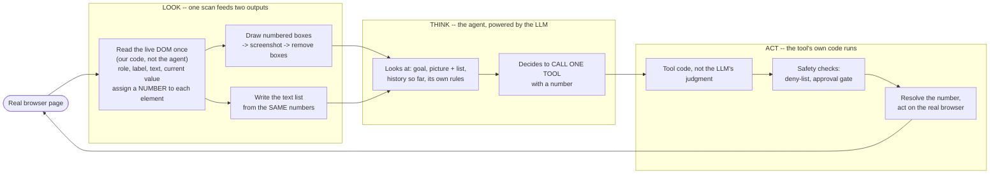

# REPORT

This report covers the design of a computer-use automation system for a real banking web app
(ParaBank), built for the interface.ai take-home. The system has three parts: a discovery agent
that learns a task by driving a real browser, a typed capability artifact that captures what it
learned, and a deterministic replay engine that runs the artifact again with no LLM involved. All
of the underlying design work happened in five notebooks (`notebooks/agent.ipynb`,
`02_artifact_schema.py`, `03_recorder.py`, `04_replay_engine.py`, `05_replay_live.py`), each
live-tested against the real site; this phase ports that logic into an importable package
(`src/cua/`) with a real test suite and a CLI, without changing any of the logic itself. Every
design decision referenced below (`D<n>`) is recorded in full in `DECISIONS.md`; the phase
write-ups (`PHASE1.md`-`PHASE5.md`) give the plain-English version with worked examples.

## Architecture

The system is one agent (discovery), one artifact format, and one generic replay engine -- not
three separate automations. The seam between them is a `Surface`: something that can look at a
page and act on it. Discovery, the recorder, and replay all talk to a surface; only the concrete
implementation differs (`src/cua/agent.py`'s `PlaywrightSurface` for discovery, the same class
reused by `src/cua/live.py`'s `PlaywrightReplaySurface` for live replay, and a hand-built
`FakeSurface` for replay's own offline tests). This is the answer to 3.7's "core abstractions must
not paint you into a corner" -- a desktop accessibility-API surface or a vision-only surface could
be added later without touching the artifact schema or either engine (D22).

**The LOOK -> THINK -> ACT loop** (D2; see `PHASE1.md` for the full worked example and diagram):

LOOK is one scan (`OBSERVE_JS`, `src/cua/agent.py`) feeding two outputs -- a screenshot with red
numbered boxes and a text list built from the same numbers -- not two separate perception channels.
The scan is entirely our own fixed code; the LLM never runs it and has no say in how a role or a
name is computed. THINK is the agent picking exactly one tool call, fresh, every step -- there is no
separate planning phase, no plan made once and executed blindly. ACT is the critical separation:
**the agent decides which tool to call; the tool's own code decides whether it is allowed to
happen.** `click()`'s approval gate, the allowlist, and locator resolution all run unconditionally
inside the tool, whatever the model asked for (D2, D33) -- this is why the system's safety does not
depend on the model's judgment, and it is the same reason replay (below) can reuse the identical
tool-independent mechanics with no LLM in the loop at all.

**Why the numbered-element + screenshot hybrid, not text-only or pixel-only (D2):** 3.1 asks for a
bias toward approaches that still work with no clean DOM -- the common case at real banks. Text-only
perception fails outright when an element has no accessible name (D67: the scanner still finds,
numbers, and shows such an element; only its *name* comes back empty, and only the screenshot lets
the model read it visually -- this is not hypothetical, it is the exact mechanism behind a real bug,
D53, found and fixed live). Pure pixel coordinates are the only option for a native desktop app but
break the moment a resolution or layout changes, which directly conflicts with "replay works next
month." The hybrid lets the model point at element `[3]`; the code resolves the number to a real
element and later saves a *description* of it, never the number or a pixel position (D8) -- the
model's judgment picks the target, but what gets persisted for replay is independent of how it was
found this one time.

**Why deep agents (D4):** `create_deep_agent` gives planning (`write_todos`), automatic context
summarization for long runs, checkpointed execution, and a pause primitive, for the cost of one
dependency. Its own `interrupt_on` pause rule was tried first for the safety gate and abandoned
after it let a bill payment through unapproved twice in live testing (D33) -- the actual gate lives
inside the `click` tool itself now, not in the framework. Deep agents are used for discovery only;
replay is deliberately not an agent (D6) -- a plain, fully-deterministic loop reading a fixed recipe.

**Why Playwright, and why our own tools instead of the Playwright MCP server (D5):** the artifact
must record *how an element was found* at the exact moment it was touched (3.2); with our own
tools this happens inline in the tool call. The human handoff (3.6) needs a human to take over the
*same live browser* the agent holds -- with MCP the browser lives in a separate server process we
do not control. The numbered screenshot (D2) and the safety/allowlist checks (3.4) are also our own
code that has to run *before* Playwright acts; tools we do not own cannot be checked before they
act.

## Artifact schema

The artifact (`src/cua/schema.py`, ported unmodified from `notebooks/02_artifact_schema.py`) is
the "recipe card" a human reviewer and a calling agent both read: what it needs, what it does step
by step, how it knows it worked, and what a surprising result means. See `PHASE2.md` for the full
cell-by-cell walkthrough with real examples from `artifacts/examples/`.

**Five locator strategies, one primary + one optional fallback (D8, simplified by D63):**

| Strategy | What it matches | Stability |
|---|---|---|
| `role` | accessible role + accessible name (e.g. `button "Log In"`) | high |
| `label` | the `<label>`/table-cell text next to a field | medium |
| `text` | visible text of a non-form element | medium |
| `structure` | the nth `<tag>` inside a *named* container | low |
| `labeled_value` | the value shown next to a label (extract-only, never clicked) | medium |

A `Target` is exactly `primary` + an optional `fallback` -- not a ranked list of up to 3 (the
original design, D8/D37) -- enforced structurally: `Target` has two named fields, so a third
locator is not representable by the type at all, a stronger guarantee than a runtime length check
(D63). Every locator's `note` field is required (`Field(min_length=1)`): a locator cannot be saved
without a stated reason to trust it, directly answering 3.2's "identification, with reasoning about
robustness." `structure` always requires a named `within` container, so a page-wide index
(`nth=18` of the whole page) is impossible to construct -- the concrete lesson from a Phase 1 bug
where a global index broke the moment anything was added to the page.

**Checkpoint (D9):** both `url_contains` and `text_present` are required, never just one -- some
pages change content without changing URL, others share a URL across states, so two independent
signals must agree before replay calls a run successful.

**Five actions:** `navigate`, `click`, `type`, `select`, `extract` -- every step in a capability is
exactly one of these, discriminated by Pydantic on `action`.

**The three-way outcome taxonomy (D10),** enforced by `OutcomeRule`'s own cross-field validator:

- `business` -- a normal, expected answer (e.g. `ACCOUNT_NOT_FOUND`). Returned as data, not an error.
- `recoverable` -- something fixable (e.g. session expiry -> re-run the login capability).
- `hard` -- a genuine break; stop, report step/expected/observed.

The brief calls conflating business outcome with failure "the most common design mistake here";
the schema makes it structurally impossible to write a rule that is ambiguous between them (a
`business` rule *must* carry an `outcome`; a `hard` rule *must not* carry one).

Secrets are referenced only by name (`{{secret:password}}`), never by value (D32); `Capability`
has a single `base_url: str` field (D64, discussed in full under Heterogeneity below); `routes` are
derived on demand from a capability's own `navigate` steps rather than a second, separately
maintained list that could drift out of sync (D65, `derived_routes()`); `description` covers both
"what this does" and "when to use it" as one field, since the original two-field split was never
read as anything but one piece of text by a calling agent anyway (D66).

## Determinism & error handling

Replay (`src/cua/replay.py`, ported from `04_replay_engine.py`) has **zero LLM in the decision
loop** (D6, 3.3): `run_capability`/`run_capability_async` read a `Capability`'s steps in order and
either do exactly what each step says or stop with a structured reason. See `PHASE4.md` (the
engine's own design) and `PHASE5.md` (the live-wiring bugs below) for the fuller narrative.

**The four-status `ReplayResult` contract (D27):**

| Status | Meaning |
|---|---|
| `SUCCESS` | done, declared outputs attached |
| `BUSINESS_OUTCOME` | a valid, expected answer -- not a crash |
| `NEEDS_APPROVAL` | stopped before a risky step, waiting on a human |
| `FAILED` | hard failure, with `step_index`/`step_action`/`expected`/`observed` |

`NEEDS_APPROVAL` is deliberately its own status, not folded into `FAILED` -- a caller should wait
for a human, not retry or give up, which is exactly the distinction 3.3 asks replay to preserve.
`check_result()` (`src/cua/schema.py`) additionally verifies a result against the capability that
produced it (declared outputs match, a claimed business outcome was actually declared), so a
result can never silently lie about itself.

**Retries are bounded and selective (D26):** a `TransientFailure` (the page was not ready) is
retried up to `max_retries` times -- except a step is **never** retried if it is a risky click
(`step.risk == "risky"`), so a slow page can never cause the same money-moving click to fire twice.
This is enforced once, in the engine's own step loop, identically in both the sync and async
engines.

**The three-way outcome taxonomy's role here:** after every step, the current page's URL and text
are checked against the capability's own `outcome_rules`, first match wins (`_find_outcome_rule`,
a pure function shared by both engines so they can never pick a different rule, D77). A `business`
match returns immediately with the declared outcome; a `hard` match returns `FAILED`; a
`recoverable` match is logged and replay continues -- this is where the three-way split from the
schema actually earns its keep at replay time, not just at record time.

**D85 -- the one real correctness bug in the risky-click gate, found and fixed live:** the original
design had `escalate()` perform an approved click as a *side effect*, while the engine
unconditionally returned `NEEDS_APPROVAL` regardless of whether the human approved or rejected --
meaning a real payment could go through with the typed result claiming nothing had happened yet,
and the capability's own remaining steps (an `extract` reading the real confirmation, the final
checkpoint) were never reached even on a genuine approval. The fix: `escalate`'s **return value**,
not a side effect inside it, now decides. Exactly the string `"approve"` makes the engine itself
resolve the target and click it -- through the identical `resolve_target`/`surface.click` path an
ordinary click already uses -- then continue the loop into the remaining steps; anything else
(including the default `None`) is the unchanged `NEEDS_APPROVAL`. This is tested in
`tests/test_replay.py` (`test_integration_transfer_funds_escalate_approves_over_limit_click` and
its unresolvable-target and non-approve-string siblings) and was verified byte-for-byte
non-breaking against every prior test at the time.

**Three real bugs found only by pointing replay at the actual live ParaBank page (D87-D89), not
by any offline `FakeSurface` test -- concrete, honest evidence this was battle-tested against a
real, imperfect legacy-style page, not a clean happy path:**

1. **D87 -- label-decoration mismatch.** The declared locator said `label: Balance`; the real page's
   column header is `"Balance*"` (a footnote asterisk). The old normalization only stripped a
   trailing colon. Fixed by generalizing to strip *one* trailing non-alphanumeric character,
   verified not to over-loosen (`"Balance"` still != `"Available Amount"`).
2. **D88 -- an async-content race.** ParaBank's Accounts Overview page renders its account table
   via a jQuery AJAX call that completes *after* the page's own `load` event; a single immediate
   `resolve()` attempt could race it. Fixed with a bounded poll (0.4s interval, 5s total budget)
   inside `PlaywrightReplaySurface.resolve()` -- a different mechanism from `TransientFailure`'s
   step-level retry (D26): this one re-checks the live DOM before ever reporting a miss to the
   engine at all.
3. **D89 -- wrong extraction target.** The `labeled_value` locator for "Balance" matched only the
   table's own column *header* (whose next sibling cell is "Available Amount", another header) --
   wrong regardless of how many accounts the user has, not an ambiguity that more rows would
   create. Fixed by repointing the same, unmodified `labeled_value` mechanism at the table's own
   "Total" footer row instead.

None of these three were bugs in the engine's own logic (locator resolution, template
substitution, the risk gate, outcome rules, the checkpoint) -- every one lived in real-DOM-facing
code (a label's exact text, a page's real load timing, a locator's own chosen target). That split
is exactly what the `FakeSurface`/real-`Surface` architecture (D22) is for: the engine was provable
correct entirely offline, and the real bugs it still hit on first live contact are the honest,
expected residue of real pages having real quirks a fake can't reproduce.

## Heterogeneity & multi-tenant

This was **cut from the schema itself** and kept as a design discussion, per the assignment's own
"design, not necessarily build" allowance (Section 3.7). The original schema (D21, D37, D40)
carried `app.id`, `app.vendor`, `base`, and `overrides` as shape-checked-only fields, gesturing at
multi-tenant reuse without building the machinery to apply an override. D64 cut all four during
the schema simplification: `Capability` now has a single `base_url: str` field and nothing else.
The reasoning, direct from `DECISIONS.md` D64: those fields were "validated for shape only and
never applied" -- carrying that dead weight in every artifact file is not free, since a human
reviewer has to read past it, and Section 3.7 asks that the *core abstractions* not paint you into
a corner, not that every future idea get a placeholder field today.

**What a real multi-tenant version would add**, following D21's own original reasoning (search
`DECISIONS.md` for "D21" for the fuller argument):

- **One base capability per vendor product, plus small per-tenant override files** -- not one
  artifact per tenant, which does not scale past a handful of tenants x apps. Locators identify
  *what a control is* (role + accessible name, D8) rather than a pixel position or an app-specific
  ID, which is exactly the property that survives different branding: most steps stay shared.
- **An override patches only what genuinely differs** for one tenant (e.g. the submit button reads
  "Sign In" instead of "Log In"), so a vendor-wide UI update fixes the shared base once instead of
  re-recording hundreds of near-identical capabilities.
- **A per-tenant deployment config** resolving `base_url`, secrets, and an allowlist -- this is
  exactly the shape `base_url` would need to move into if this were built: either a per-tenant
  override input, or a separate deployment-config file entirely outside the capability artifact
  itself (D64's own stated cost of the cut).
- **Drift detection, essentially free from data already logged today.** `resolve_target`/
  `resolve_target_async` already log which locator level matched -- primary or fallback -- every
  time (`logger(...)` calls in `src/cua/replay.py`). A tenant whose replay keeps falling to the
  weaker fallback locator, or whose checkpoint keeps almost-but-not-quite matching, is a real,
  cheap-to-compute signal that its copy of the vendor UI has drifted from the recorded base and
  needs a human to look at it -- without building anything new to produce that signal.

**Why this was cut for this take-home's scope, not built:** Section 7 explicitly states building
tenant plumbing is not rewarded, and Section 5 asks that depth go into the schema, replay/error
handling, and safety/escalation instead of scaling infrastructure. A single, real vendor
integration (ParaBank) already exercises every mechanism a multi-tenant version would need
(locator strategies, the checkpoint, outcome rules); what is missing is purely the *config and
override-resolution* layer around it, not a redesign of the artifact or the engine.

**What would have to change to add it back:** (1) reintroduce a small deployment-config concept
(tenant -> `base_url` + secret env-var names + allowed routes), separate from the capability
artifact so one capability file still serves every tenant; (2) an override-application step between
loading a capability and running it, patching specific locators/text by tenant id; (3) surface the
drift signal above as an actual metric/alert rather than a log line a human has to go looking for.
None of these three require touching `Target`, `Step`, or the engine's own step loop -- the
locator-and-checkpoint design already carries what an override needs to patch.

## Escalation & handoff

The human-in-the-loop mechanism is real code, exercised through many rounds of live testing
against actual failure modes (D50-D62), not a mocked stand-in -- see `PHASE1.md` for the mechanism
as designed and `DECISIONS.md` sections K/N for the bugs found building it.

**Discovery side (`src/cua/agent.py`):**

- `ask_human(question)` -- free-form: "I'm unsure what to click." Refuses on the start page (too
  early to ask anything useful, D34) and hands the whole page (minus the risky button, D56) to a
  human.
- `request_value(ref, hint)` / `request_missing_values(hints)` -- a *known, specific* field (or
  list of fields) needs a value the user never gave. `hint` closes a real gap (D53): the model's
  own visual reading of a field's label, from the screenshot, now reaches the human-facing message
  even when the DOM gives the field no name at all -- previously the message said only "field 17."
  Both refuse to ask about a field that is already filled, checked in code, not left to the model's
  memory (D54): `_ask_for_value` reads the field's live value first.
- **The whole-page lock + risky-element block (D56-D62).** While it is the agent's turn, a human
  can neither click nor type anywhere on the real page -- only the injected UI (banner, decision
  bar) is interactive, at a higher z-index than the lock. During an ordinary handoff the general
  lock stays fully active and only the specific field(s) needed are individually poked open with a
  visible green outline (D62's `allow_refs`) -- a human filling in a missing city cannot also click
  the real Send Payment button, because nothing but that one field is unlocked.
- **The approve/reject/take-over decision bar (`click()`'s own gate, D33).** Every button except a
  short safe list (`log in`, `find transactions`) needs a human before it runs, enforced inside the
  `click` tool itself -- not a framework pause rule, after `interrupt_on` twice let a payment
  through unapproved in live testing. The risky button is blocked *before* the bar is even shown
  (D57), not only afterward, closing a real gap where a human clicked the real button directly
  during the decision window.

**Live-replay side (`src/cua/live.py`):**

- **`make_escalate`** wires the identical decision bar discovery uses to replay's `escalate` hook
  (D79, corrected by D85 above): approve resolves and clicks through the engine's own normal step
  path; reject and take-over both leave the result at `NEEDS_APPROVAL`, with take-over deliberately
  *not* claiming approval, since the engine cannot safely infer a click happened just because a
  human took the wheel.
- **`gather_missing_inputs`, a pre-flight gate (D91).** A real live run hit a raw
  `InputValidationError` traceback naming five missing required inputs, with no chance to fix them
  before the whole run had already started. `replay_live` now checks `cap.inputs` against the
  caller's own dict *before* anything else happens -- before the browser does anything, before
  login, before any step -- and interactively prompts (bounded at 5 attempts per field, reusing
  `validate_inputs`'s own pattern check) for whatever is missing. `run_capability_async`'s own
  `validate_inputs` is completely untouched: a no-human, scheduled replay still fails fast and
  loudly on a missing input, exactly as before.

**Honest gap:** the original roadmap (Phase 7) named six triggers for detecting a discovery run is
"stuck" (step limit, same-screen-same-action repetition, repeated failures, policy-blocked, the
agent's own `ask_human`, a time limit with no progress). The step limit, the login-attempt cap
(D69), and `ask_human` are real and enforced in code; the "same action three times" and "time limit
with no progress" triggers are mentioned in the system prompt as an instruction to the model
("if you repeat the same action 3 times, call finish with STUCK") rather than enforced as a
separate, independent code-level guard the way the login-attempt cap is. The mechanism as a whole
is real and heavily tested; the six triggers were never formally enumerated and checklisted one by
one the way, for example, the login-attempt guard was (D69's own pure `login_check`, tested for
exactly three cases: blocks on known failure text, blocks at the hard attempt cap, does not block
otherwise). This is stated here plainly rather than left implicit.

## Safety

- **Allowlist (D15), minimal single-host version, honestly not the full routes/actions system
  originally scoped.** `src/cua/config.py`'s `host_allowed(url)` checks a URL's host against
  `ALLOWED_HOSTS = {"parabank.parasoft.com"}`, enforced in code before Playwright acts (`click`,
  `type_secret`, `open_path`, and `PlaywrightReplaySurface.navigate` all check it), and re-checked
  in replay independently of discovery. What was **not** built: a full `allowlist.yaml` with
  per-route and per-action-type rules (the original D15 design). `derived_routes()`
  (`src/cua/schema.py`) computes which routes a capability touches from its own `navigate` steps,
  which is the data a route-level allowlist would need, but nothing today checks a capability's
  routes against a declared allowed set -- the domain check is real and enforced; the finer-grained
  route/action policy is a stated cut (see below).
- **Secrets handling (D32).** A secret is referenced in an artifact only by name
  (`{{secret:password}}`), resolved at replay time by `cua.config.resolve_secret`, which reads
  `.env` and raises on an unknown name or an empty value. The model that drives discovery never
  sees a secret's value -- `type_secret(ref, name)` types the real value directly into the page from
  `.env`, and the tool's own result text never includes it. `save_capability` (`src/cua/recorder.py`)
  additionally refuses to write a file at all if a caller-supplied `forbidden` value (a real secret
  value, when available) is found anywhere in the YAML about to be written -- defense in depth, not
  a claim that the normal path could ever produce that value in the first place.
- **The risky-click auto-approve-limit gate is checked BEFORE the click, never after (D38).** In
  `run_capability`/`run_capability_async`, a risky step's dollar amount is read from its declared
  `amount_input` and compared against `auto_approve_limit` *before* `resolve_target`/`surface.click`
  are ever called. At or above the limit, the engine calls `escalate` and returns `NEEDS_APPROVAL`
  without touching the page at all unless a human explicitly approves (D85, above) -- there is no
  code path where an over-limit click fires and only *then* asks permission.
- **D85's fix so approving actually completes, rather than lying about it.** Covered in full under
  Determinism & error handling above; listed here too because it is fundamentally a safety property
  as much as a correctness one -- before the fix, a human's real "Approve" decision on a real
  payment produced a typed result indistinguishable from a rejection, which is exactly the kind of
  silent gap 3.4's "safety and data handling" cares about.
- **Deny-by-default on clicks (D33), not a maintained deny-list.** Every button needs a human
  unless its name is on a short safe list (`log in`, `find transactions`) -- a new button the
  recorder has never seen is risky by default, rather than requiring someone to remember to add it
  to a list. `DENY_LINKS` (register/lookup/admin) is a separate, small denial list for navigation
  links, not the primary safety mechanism.
- **Redaction was designed (D16, D18) but not built as a standalone `redact()`/screenshot-covering
  function** -- see Cuts below.

## Cuts

An itemized, honest list of what was simplified or deliberately not built, pulled from
`PHASE1.md`-`PHASE5.md` and `DECISIONS.md` into one place, as this section is meant to be:

1. **Locator ranking simplified from up to 3 to primary + one fallback (D63).** The original design
   (D8/D37) ranked up to three locators per target; in practice neither hand-written example
   artifact ever populated a third one. The structural change (two named fields, not a list) makes
   a third locator unrepresentable by the type, not just discouraged.
2. **Multi-tenant fields cut from the schema (D64), covered in depth in the Heterogeneity section
   above.** `app.id`, `app.vendor`, `base`, `overrides` are gone; only `base_url` remains. Full
   reasoning and what would need to change to add it back is in that section, not repeated here.
3. **`redact()`/screenshot-covering (D16, D18) designed, not built.** The original design specified
   one choke-point `redact()` function every log line and artifact write must pass through (label
   rules for `Password`/`SSN`, plus value-pattern rules for SSN-shaped/card-shaped numbers), and a
   page-script mechanism to cover sensitive fields before a screenshot is taken so neither the
   model nor saved evidence ever see them raw. Neither exists in the shipped code. What exists
   instead: secret *values* never reach the model or a log line in the first place (`type_secret`
   never returns the value it typed, D32), and `save_capability`'s own forbidden-value guard is a
   narrower, artifact-write-only backstop (see Safety above) -- real but not the general-purpose
   redaction layer originally scoped.
4. **The allowlist is a minimal, single-domain check, not the full `allowlist.yaml` with routes and
   action types Phase 6 originally envisioned.** `host_allowed()` checks only the domain; a
   capability's own routes are derivable (`derived_routes`) but nothing enforces them against a
   declared allowed set today. See Safety above.
5. **"All six stuck triggers" from the original roadmap's Phase 7 were never formally enumerated
   or checklisted, even though the underlying mechanism is real and heavily tested.** See
   Escalation & handoff above for exactly which of the six are code-enforced today (step limit,
   login-attempt cap, `ask_human`) versus prompt-only instructions to the model (repeat-detection,
   time-limit-with-no-progress).
6. **The recorder's CAPTURE half still duplicates `agent.ipynb`'s tool code, verbatim, rather than
   sharing one implementation -- a stated, deliberate, temporary duplication (D73), carried forward
   by this port rather than resolved.** `notebooks/03_recorder.py`'s own BROWSER cells copy
   `agent.ipynb`'s setup/scanner/tools/safety cells verbatim and then wrap each tool to log an
   event; this port's own CLI (`src/cua/cli.py`'s `discover` command) does the analogous thing --
   it builds tools from `cua.agent.DiscoveryAgent` (the one real implementation) and wraps them
   for event capture in `cli.py` itself, so the *tool logic* is no longer duplicated the way the
   notebooks' own copy-paste was -- but the event-wrapping/CAPTURE-half glue (which tool call
   becomes which event shape, `extract_value`/`open_path`/`finish_business_outcome`, the
   `request_value`/`request_missing_values` synthesis wiring) is deliberately kept out of
   `cua.recorder`'s own importable API (which stays pure Python, no Playwright import, per this
   phase's own hard requirement) and lives instead as agent-side orchestration code in `cli.py`.
   This is a real, load-bearing design choice worth being explicit about: `cua.recorder.compile_run`
   is genuinely reusable from any capture mechanism that can produce the right event shape; the
   *capture* mechanism itself is CLI-specific glue, not a general library.
7. **The CLI's `discover` command simplifies how declared inputs get their type/pattern/
   description, compared to the notebooks' own workflow.** `03_recorder.py`'s own BROWSER cells
   have a human write out each input's exact `type`, `description`, and validation `pattern` by
   hand before compiling (e.g. `account_id`'s pattern `^[0-9]{4,10}$`). `cua discover --input
   name=value` infers a type from the value's own shape (currency-looking -> `currency`,
   digits-only -> `integer`, else `string`) and uses a generic, permissive pattern and a
   templated description. This is faster but less precise than the notebook's own hand-specified
   spec; a reviewer promoting a `draft` capability to `verified` should tighten these by hand,
   exactly as D90's own auto-declared human-entered inputs already require.
8. **The optional TypeSafe tool-selection/model-router middleware (D50, D52, D76) is not wired
   into `cua discover`.** Both notebooks (`agent.ipynb` and `03_recorder.py`'s capture half) carry
   this, off by default unless `TYPESAFE_API_KEY` is set. The CLI's own discovery path does not
   build or offer this middleware at all -- a deliberate simplification for the port, since it is
   an optional third-party performance layer (not a safety mechanism) that the user must
   explicitly opt into and pay for even in the notebooks.
9. **A genuine, pre-existing bug found during this port, not introduced by it:**
   `notebooks/02_artifact_schema.py`'s own offline checks currently crash with `IndexError`
   (`uv run python notebooks/02_artifact_schema.py`) -- two Section 2b cells assume
   `artifacts/examples/get_account_balance.yaml` still has 3 `outcome_rules` (true when written,
   simplified away by the later D63-D66 schema rebuild). `tests/test_schema.py` tests the
   identical two validation rules (a recoverable rule needs an action; a hard rule carries no
   action) against a fixture built to actually have that shape, so the ported package's own test
   suite is unaffected -- but the notebook itself, unmodified per this phase's own hard rule, does
   not currently print "ALL CHECKS PASSED" if run top to bottom.
10. **Not built, by design, per the original scope decisions (D21-D31), unchanged by this port:**
    an operator console beyond the injected decision bar/lock (a real remote operator UI was
    explicitly out of scope); a parked/resumable session approval flow (D28 chose "hold the browser
    open in the same process" over a cross-process resumable design, and named the latter as the
    real production shape); an image-based locator fallback (rejected in D8 as brittle and a
    sensitive-data risk); an API/service wrapper around the CLI; an assisted-LLM replay fallback;
    a live end-to-end test in CI (D31 -- the real, live evidence lives in `/evidence/` instead,
    since a live test against a public third-party site would be flaky and could annoy it).
