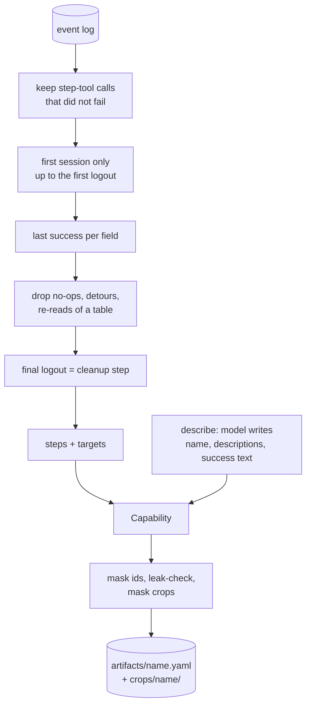

# Recorder (event log to capability)

Turns one discovery run into a capability. Steps come from the event log, never from the model.
The model writes only the name, descriptions and success text. Pure Python, no browser.

## Where it lives

- [`src/cua/discovery/recorder/`](../../src/cua/discovery/recorder/)
  - `events.py`: which logged calls become steps (filters), `NotSaved`, `flag_leaks`.
  - `build.py`: `build_capability`, `check_savable`, `to_step`, `target`, `output`.
  - `checkpoint.py`: picks the checkpoint text.
  - `types.py`: infers each input's type from the shapes logged at typing time.
  - `save.py`: `describe` (the one model call), `save_artifact`, `crops_for`, `ArtifactMask`.
- Called from `cua.cli._save` after `run_goal` ([CLI and eval](cli-and-eval.md)).

## How it works

1. **`check_savable(log)`** runs first, before any model call. It raises `NotSaved` (with a
   plain reason) when:
   - a human took over (an event with `recordable: false`): the run has steps the agent never saw;
   - a label or target text is a value typed this run (a leak);
   - a dropdown has no label to find it by (only its crop);
   - nothing was read and nothing was sent (a caller would get `SUCCESS` with no data).
2. **`step_events(log)`** filters the log (R16):
   - keep `click`, `scroll`, `open_path`, the field tools and the read tools whose result did not
     fail, block or stop;
   - cut at the first logout (a later re-login is not part of the task);
   - keep the last success per field (page path + label); a later select on the same spot wins;
   - mark a click right after typing on the same page, or a login click, as a submit (never a
     detour or no-op);
   - one step per table, even if it was re-read after scrolls;
   - drop no-op clicks, repeated identical clicks, and a scroll undone by the next page load;
   - cut detours; the final logout becomes a `cleanup: true` step.
3. **`build_capability(log, meta, values)`** maps each event to a step (`to_step`) with a target
   (rungs: OCR text, anchor + offset, template crop, table cell). It also:
   - refuses a capability whose secrets are typed after the first click (`NotSaved`: login out of
     order);
   - takes `base_url`, `viewport` and scale from the `start` event;
   - types each input from the shapes logged when it was typed (`types.py`; precedence email,
     phone, date, currency, number, integer, id; else `string`);
   - lists outputs from the read steps and secrets from `type_secret` names;
   - picks the checkpoint (`checkpoint.py`), always "stable" text (never a value, a digit, a lone
     label or a link bar). After a send: the page's own response, preferring the agent's proof
     text. A read-only run: text on the page of the last read that no earlier screen showed;
     with none new, the best stable text is kept and a warning logged. Otherwise the agent's
     proof text, else the model's `success_text`.
4. **`describe(goal, log, model, ids)`** asks the model for `CapabilityMeta` only, with account ids
   cut. The prompt lists step labels and input names, never values.
5. **`save_artifact(cap, crops, out_dir, mask)`** masks account ids in text fields, refuses
   (`NotSaved`) if any run value or secret is still there, masks the crops by OCR, writes
   `<out>/<name>.yaml` and `<out>/crops/<name>/s<i>.png`, then re-loads the YAML through
   `Capability` (what replay will load).

## Public API / key types

`check_savable`, `build_capability`, `describe`, `save_artifact`, `crops_for`, `ArtifactMask`,
`NotSaved`, `step_events`, `checkpoint`, `input_types`, `shapes_of`, `flag_leaks`.

## Config knobs

None of its own. `--out` on `cua discover` sets the folder (default `artifacts`). Masking uses the
site's `id_min_digits` / `id_visible_digits`.

## Safety and guarantees

- The model cannot add a step or an input; its name is slugged so it cannot fail the build.
- Only each value's *shape* is logged (`shapes_of`), so types survive the end-of-run wipe.
- No file is written until the artifact is masked and leak-checked (Q23). Evidence re-checks the
  saved YAML ([evidence](evidence.md)).
- A take-over run is never saved: keystrokes are not captured, so it is not replayable.

## Tests

- `tests/unit/discovery/recorder/` (`test_recorder.py`, `test_recorder_checkpoint.py`,
  `test_recorder_reads.py`, `test_recorder_runs.py`, `test_recorder_types.py`).
- `tests/integration/test_discovery_to_replay.py` (round trip into replay's loader).
- `tests/integration/test_saved_artifacts.py` (saved artifacts re-save unchanged; input types
  match the recorder's inference).
- `tests/unit/test_cli.py` (an unsavable run prints why and never asks the model; a leak is not
  saved).

## Limits and cuts

- Per-keystroke take-over capture is cut, so a take-over run stays unsavable (REPORT §7).
- Discovery never writes `outcomes:` (REPORT §7).
- A masked `ocr_text` (an account id) no longer matches at rung 1; replay falls back to the
  anchor or template (Q23).

## Decisions

- R10 (compile lives in discovery), R11 (steps from the log, meaning from the model), R12 (step
  types), R14 (what rung 2 needs), R16 (dead ends and retries) in
  [replay-decisions.md](../decisions/replay-decisions.md).
- Q14 (private data in crops), Q21 (take-over is not recordable), Q23 (account ids) in
  [discovery-decisions.md](../decisions/discovery-decisions.md).
