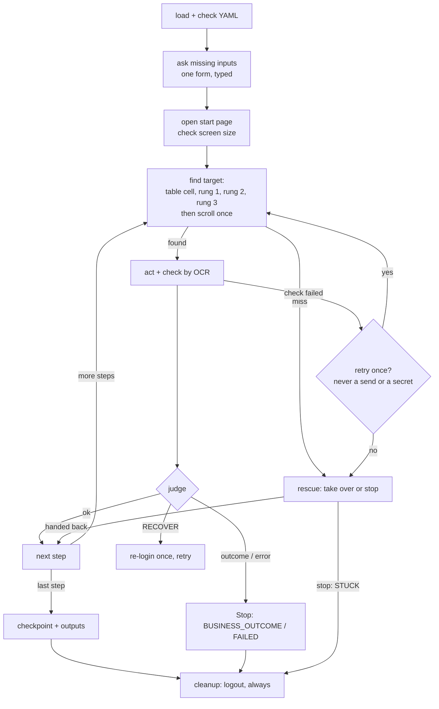

# Replay engine

Runs a saved capability with plain code. No LLM, zero tokens. Finds each target by rungs, acts,
checks the step by OCR, and judges the page against outcome rules. Cleanup (logout) always runs.

## Where it lives

- [`src/cua/replay/`](../../src/cua/replay/) (read order:
  [`replay/README.md`](../../src/cua/replay/README.md))
  - `loader.py`: `load_capability`, `load_outcomes`, input checks, `ask_inputs`, `ask_option`.
  - `locate.py`: the rungs and `locate()`. Pure.
  - `steps.py`: `find` (rungs, then scroll), `shows`, one `do_<action>` per step type, `ACTIONS`.
  - `engine.py`: `judge`, `run_step`, `walk`, `run_cleanup`, `replay`.
  - `rescue.py`: help panel -> take-over ([handoff](handoff.md)).
  - `run.py` (`ReplayRun`, `LastRun`), `context.py` (`Ctx`, `wipe`), `wiring.py` (`attach`, page
    wrappers), `evidence.py` ([evidence](evidence.md)).
- Notebook-era design walkthrough: [replay-architecture.md](../architecture/replay-architecture.md).

## How it works

1. **Load** (`load_capability`). Validates the YAML as a `Capability` and stops `FAILED` on: a
   recorded viewport or scale that differs from `BrowserConfig` (Q10 / R3), a `base_url` host not
   allowed, an unknown input type, an undeclared `{{input}}`, a `{{secret:x}}` not set in `.env`,
   or a missing crop. `load_outcomes` takes the capability's own `outcomes:` or the site's.
2. **Inputs.** `given_inputs` maps `--input` keys by name (any case); an unknown key or a value
   of the wrong type stops before the site opens. `ask_inputs` asks every missing input in one
   control-tab form, sensitive ones masked (R8). A wrong-type answer is asked once more, then
   `STUCK`; a blank answer is `STUCK`.
3. **Start.** If the capability logs in itself, cookies are cleared first. Then `goto(base_url)`
   and a screen-size check.
4. **Each main step** (`run_step`):
   - `action_allowed`: a step outside `allowed_actions` fails before acting.
   - `find`: `locate()` tries, in order, the table cell, rung 1 (own OCR text; with duplicates,
     the copy nearest the anchor within `near_px`), rung 2 (anchor label + offset), rung 3
     (`cv2.matchTemplate`; two near-equal peaks = a miss). All miss: scroll down and retry
     (`scroll_retries`). The rung used goes to the drift log.
   - Act and check (R5): `click` waits for a navigation or a settled screen change; `type`
     re-reads the box (a secret must show as dots, else `FAILED`); `select` sets the option by
     index or point and re-reads it; `extract` reads the value and checks its type (a wrong value
     tries the next rung once, then stops `STUCK`); `extract_table` reads rows and scrolls on to
     `row_limit`.
   - `judge` (R17): an HTTP error status or a raw JSON error body is `FAILED`. Then the first
     outcome rule whose text newly appeared: `BUSINESS_OUTCOME` or `FAILED` stop; `RECOVER` (or
     the login form coming back) re-runs the login steps once, never after a send.
   - A failed check is retried once. Never a send (R15) and never a secret.
   - Still failing: `rescue` shows a help panel. Take over (the human works, then hands back) or
     stop (`STUCK`).
5. **Finish** (`walk`). The checkpoint text must be on screen (bounded OCR poll) and every output
   read. A read-only run may accept a checkpoint picked after logout. After a take-over that
   reached the checkpoint, remaining non-read steps are skipped.
6. **Cleanup** (`run_cleanup`): the `cleanup: true` logout runs in a `finally`, whatever the
   status (R20).
7. **Wipe** (R7): `replay()`'s `finally` swaps in a fresh `ReplayRun`. Only `ctx.last.values`
   (the mask set) and the final screen stay, in memory, for evidence.

### Statuses (R17)

| Status | When |
|---|---|
| `SUCCESS` | all steps done, checkpoint seen, outputs read |
| `BUSINESS_OUTCOME` | a known answer, e.g. "insufficient funds" |
| `DECLINED` | a human said no at Gate 2; nothing sent |
| `STUCK` | a human stopped it or rejected Gate 1, or an input was blank or wrong |
| `FAILED` | bad YAML, wrong screen size, host blocked, action not allowed, checkpoint or output missing |

A dropdown value that is not a live option opens `ask_option`; the choice is recorded in
`result.human` as `kind: "option"` (the value never is).

## Public API / key types

`replay(ctx, path, inputs) -> ReplayResult`, `attach(session, site, cfg) -> Ctx`,
`load_capability`, `load_outcomes`, `locate`, `steps.ACTIONS`, `rescue`, `save_evidence`,
`ReplayRun`, `LastRun`. Usage snippet: [`replay/README.md`](../../src/cua/replay/README.md).

## Config knobs

- `ReplayConfig`: `fuzzy`, `template_threshold`, `template_margin`, `scroll_retries`, `check_s`,
  `poll_ms`, `gate_s`, `near_px`, `short_value`, `field_min`, `snap_s`, `page_s`
  ([config](config.md)).
- Site profile: `outcomes`, `allowed_actions`, `allowed_hosts`, `login_words`.

## Safety and guarantees

- No LLM import anywhere in `cua.replay`. Never imports `cua.discovery` (import-rule test).
- Every send meets Gate 1 and Gate 2; replay never auto-approves (R6, R15) ([safety](safety.md)).
- A click or `navigate` that leaves the allowed hosts stops `FAILED`.
- The drift log holds rungs, points and attempts, never values (R18).

## Tests

- `tests/unit/replay/` (`test_loader.py`, `test_locate.py`, `test_replay_steps.py`,
  `test_replay_engine.py`, `test_replay_extract.py`, `test_replay_table.py`,
  `test_replay_inputs.py`, `test_replay_rescue.py`, `test_replay_handback.py`,
  `test_replay_wiring.py`, `test_replay_evidence.py`).
- `tests/integration/test_discovery_to_replay.py`, `test_saved_artifacts.py`.

## Limits and cuts

- No assisted-LLM fallback when every rung misses; a human rescues instead (REPORT §7).
- No per-step `expect` text (R14).
- Masking is only as good as OCR (REPORT §6).
- Offline tests use fake pages; there are no live CI tests.

## Decisions

R1-R8, R13, R15, R17-R21 in [replay-decisions.md](../decisions/replay-decisions.md);
Q8 / Q8b (tables), Q13 (scrolling) in [discovery-decisions.md](../decisions/discovery-decisions.md).
