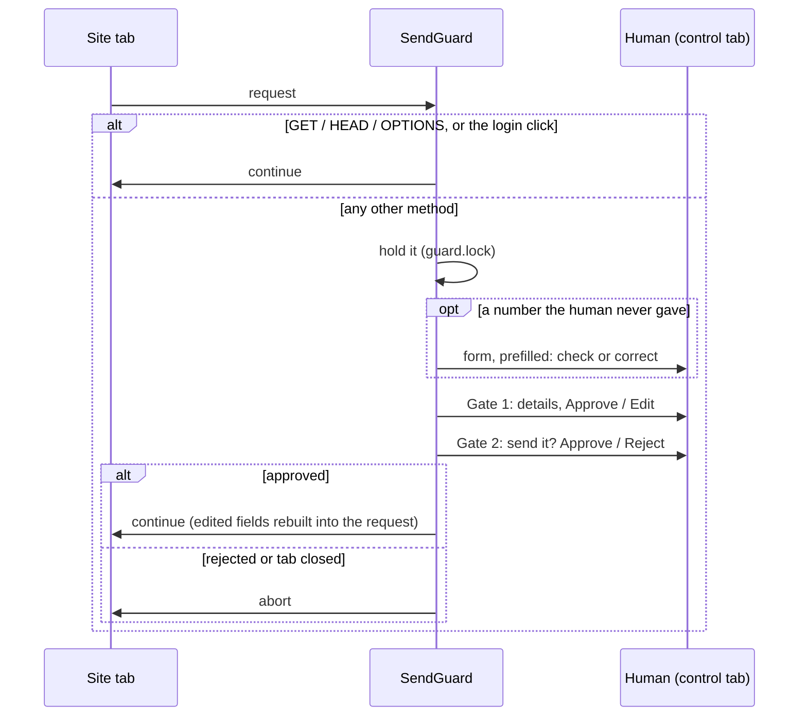

# Safety: send gates, host lock, masking

What may leave the tab, and keeping values out of everything stored, logged or shown. Shared by
discovery and replay. The NeMo goal and answer rails are a separate layer:
[guardrails](guardrails.md).

## Where it lives

- [`src/cua/safety/`](../../src/cua/safety/) (read order:
  [`safety/README.md`](../../src/cua/safety/README.md))
  - `send_guard.py`: `SendGuard`, `SendHooks`, `GuardOptions` (`DISCOVERY_OPTIONS`,
    `REPLAY_OPTIONS`), `SendState` / `ControlLike` protocols.
  - `mismatch.py`: `mismatches`, `dropdown_options`.
  - `request.py`: `sent_fields`, `rebuilt`, `pretty`.
  - `hosts.py`: `host_allowed`.
  - `redact.py`: `redactor`, `safe_redactor`, `IdMask`, `hide_secrets`, `is_sensitive`,
    `no_session`, `mask_png`.
  - `rails.py`, `nemo.py`: the guardrails ([guardrails](guardrails.md)).
- Tool-level checks live with their side: `discovery/tools/guard.py`, `replay/engine.py`,
  `replay/steps.py`.

## How it works

### Send gates (`SendGuard`)

Installed as the site tab's route handler (`page.route("**/*", guard)`) by each side's `attach`.

- Every non-GET is held at the network layer. The login click is exempt: the run sets
  `allow_send` only around a click whose text is in `login_words`.
- **Mismatch check.** Digit groups in the request that the human never gave (goal + answers for
  discovery; inputs + edits for replay) open a prefilled form first. Sensitive fields are skipped.
  Unconfirmed = `STUCK`, nothing sent. A dropdown field gets the page's options, read before the
  click (the guard never touches the page while it holds a request).
- **Gate 1** shows the path and fields (sensitive ones as `******`, secrets hidden) and the last
  screenshot. Edit = a form with every editable value, then Gate 1 again.
- **Gate 2** repeats the details: "This cannot be undone." Reject = `DECLINED`, nothing sent.
- A closed control tab fails closed (`STUCK`, aborted).
- A human's own send during a take-over skips the mismatch check (they chose every value) but
  still meets both gates.
- `guard.lock` is held while a request waits, so `act()` and screenshots wait for it.

### Host lock and action allowlists

- `host_allowed(url, site)`: the URL's host must be in `allowed_hosts` (`about:blank` passes).
- Checked after each navigation, not per request:
  - discovery: `click` goes back if it left the site (`BLOCKED`); `open_path` and `type_secret`
    refuse; a take-over that ends off-site is sent back to `base_url`;
  - replay: the capability's `base_url` at load; `navigate` and `click` stop `FAILED`; a take-over
    that ends off-site stops `FAILED`.
- `deny_words`: discovery refuses a click or path containing one.
- `allowed_actions`: discovery returns `REFUSED`; replay fails the step before acting.

### Masking

- `safe_redactor(values, secrets, ids)`: secrets masked whole first, then account ids to their
  last digits, then the run's values. Used for everything written to evidence.
- `IdMask`: a run of `id_min_digits`+ digits standing alone is an account id: `98765` ->
  `***765`. Amounts, timestamps, hashes and short numbers are not ids (Q23).
- `mask_png(png, redact, ocr_fn, ids)`: OCR the image and black out any box holding a run value or
  secret; an id-only box keeps its last digits by width share.
- `no_session(url)`: drops `;jsessionid=...` and, by default, the query.
- Discovery uses `NUMBER`; replay uses `REPLAY_NUMBER` (whole numbers only, never the `1` in
  `rung1`).

## Public API / key types

`SendGuard(state, control, secrets, sensitive_words, hooks, *, options)`, `SendHooks`,
`GuardOptions`, `DISCOVERY_OPTIONS`, `REPLAY_OPTIONS`, `SendState`, `mismatches`,
`dropdown_options`, `sent_fields`, `rebuilt`, `host_allowed`, `IdMask`, `safe_redactor`,
`redactor`, `hide_secrets`, `is_sensitive`, `no_session`, `mask_png`.

## Config knobs

- Site profile: `allowed_hosts`, `deny_words`, `login_words`, `allowed_actions`,
  `id_min_digits`, `id_visible_digits` ([config](config.md)).
- `BrowserConfig.sensitive_words` (password, ssn, social): fields masked at the gates and skipped
  by the mismatch check.
- `DiscoveryConfig.handback_s` / `ReplayConfig.gate_s`: how long a take-over waits for a held send.

## Safety and guarantees

- Neither the agent nor replay ever approves a send. Only a human click in the control tab does.
- The guard is never given a page: a held form POST would block every page call.
- `SendGuard` is built inside the running loop (its locks).
- Secrets: names only in code, logs and the model's context; values come from `.env`.
- Nothing stored (R7): values never enter logs or YAML; evidence is masked as text (`***`) and in
  PNGs (black boxes).

## Tests

`tests/unit/safety/` (`test_send_guard.py`, `test_mismatch.py`, `test_request.py`,
`test_hosts.py`, `test_redact.py`, `test_redact_more.py`, `test_mask_ids.py`, plus the rails
tests); `tests/integration/test_evidence_clean.py` (no session token or raw account id in stored
evidence).

## Limits and cuts

- Masking is only as good as OCR: a misread value is not blacked out (REPORT §6).
- The gates trust the human reading them.
- The host lock is checked after navigations, not on every sub-request.

## Decisions

Base ("hard rules kept"), Q16, Q17 (per-click approval, later replaced by the network gates), Q21,
Q23 in [discovery-decisions.md](../decisions/discovery-decisions.md); R6, R7, R9, R15, R22 in
[replay-decisions.md](../decisions/replay-decisions.md).
